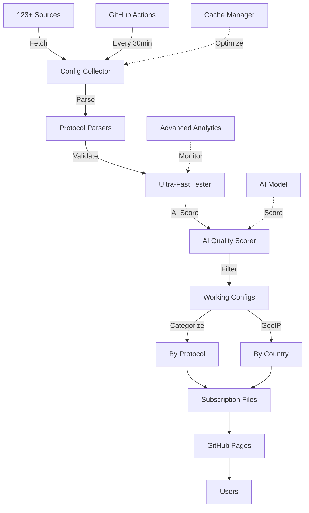

# 🚀 V2Ray Collector - جمع‌آوری هوشمند کانفیگ‌های V2Ray

<div align="center">


**🚀 Advanced V2Ray Config Collector & Tester | جمع‌آوری و تست هوشمند کانفیگ V2Ray**

**🤖 AI Quality Scoring + ML Analysis + REST API + Health monitoring | Auto-update 30min | بروزرسانی خودکار هر 30 دقیقه | 10,000+ configs from 123+ sources**

[🌐 دریافت کانفیگ](https://ahmadakd.github.io/Onix-V2Ray-Collector/) • [📚 مستندات](https://github.com/AhmadAkd/Onix-V2Ray-Collector/tree/main/docs) • [🐛 گزارش باگ](https://github.com/AhmadAkd/Onix-V2Ray-Collector/issues) • [🌟 ستاره بدهید](https://github.com/AhmadAkd/Onix-V2Ray-Collector)

</div>

---

## 📑 فهرست مطالب

- [✨ ویژگی‌های کلیدی](#-ویژگیهای-کلیدی)
- [🤖 هوش مصنوعی و ML](#-هوش-مصنوعی-و-ml)
- [🎯 معماری سیستم](#-معماری-سیستم)
- [🚀 شروع سریع](#-شروع-سریع)
- [📊 داشبورد و آمار](#-داشبورد-و-آمار)
- [🔧 پیکربندی پیشرفته](#-پیکربندی-پیشرفته)
- [📡 پروتکل‌های پشتیبانی شده](#-پروتکلهای-پشتیبانی-شده)
- [🌍 دسته‌بندی جغرافیایی](#-دستهبندی-جغرافیایی)
- [🤝 مشارکت](#-مشارکت)
- [📄 مجوز](#-مجوز)

---

## ✨ ویژگی‌های کلیدی

### 🔥 **قابلیت‌های اصلی**

<table>
<tr>
<td width="50%">

#### 🤖 **جمع‌آوری هوشمند**

- ✅ **123+ منبع معتبر** از GitHub و منابع عمومی
- ✅ **پشتیبانی SingBox JSON** برای فرمت‌های مختلف
- ✅ **Base64 Decoding** با پشتیبانی کامل از تمام فرمت‌ها
- ✅ **حذف خودکار تکراری‌ها** با الگوریتم بهینه
- ✅ **Cache Manager** برای کاهش درخواست‌های شبکه
- ✅ **Error Recovery** با retry و fallback
- ✅ **Health Check** خودکار سیستم و منابع

</td>
<td width="50%">

#### ⚡ **تست فوق سریع**

- ✅ **Ultra-Fast Connection Pool** با 50 تست همزمان
- ✅ **Advanced Protocol Testing** با handshake و response validation
- ✅ **Timeout Management** برای عملکرد بهینه
- ✅ **Retry Logic** با exponential backoff
- ✅ **میانگین 10,000+ کانفیگ** در هر بروزرسانی

</td>
</tr>
<tr>
<td width="50%">

#### 🎨 **رابط کاربری مدرن**

- ✅ **Dashboard تحلیلی** با Chart.js
- ✅ **Real-time Statistics** با بروزرسانی خودکار
- ✅ **طراحی Responsive** سازگار با موبایل
- ✅ **Dark/Light Theme** با localStorage
- ✅ **Copy با یک کلیک** برای تمام لینک‌ها
- ✅ **REST API** با FastAPI و Swagger UI
- ✅ **Performance Monitoring** و Metrics

</td>
<td width="50%">

#### 🗂️ **دسته‌بندی هوشمند**

- ✅ **دسته‌بندی پروتکل** (VMess, VLESS, Trojan, SS, SSR, Hysteria)
- ✅ **دسته‌بندی کشور** با GeoIP Lookup
- ✅ **فیلتر بر اساس Latency** 
- ✅ **Subscription Links** برای هر دسته
- ✅ **Auto-Generated Files** در هر 30 دقیقه
- ✅ **ML-based Scoring** برای انتخاب بهترین کانفیگ
- ✅ **SQLite Database** برای تاریخچه و trends

</td>
</tr>
</table>

---

## 🤖 هوش مصنوعی و ML

### 🧠 **AI Quality Scoring System**

<table>
<tr>
<td width="50%">

#### 🎯 **Machine Learning Features**

- ✅ **RandomForest Model** برای پیش‌بینی کیفیت
- ✅ **Feature Engineering** با 15+ ویژگی
- ✅ **Quality Categories** (عالی، خوب، متوسط، ضعیف)
- ✅ **Confidence Levels** برای پیش‌بینی‌ها
- ✅ **Model Retraining** با داده‌های جدید
- ✅ **Feature Importance** analysis

</td>
<td width="50%">

#### 📊 **Quality Metrics**

- ✅ **Latency Score** - امتیاز تأخیر
- ✅ **Security Score** - امتیاز امنیت
- ✅ **Stability Score** - امتیاز پایداری
- ✅ **Performance Score** - امتیاز عملکرد
- ✅ **Overall Score** - امتیاز کلی
- ✅ **Real-time Dashboard** charts

</td>
</tr>
</table>

### 🔍 **AI Analysis Features**

```python
# نمونه استفاده از AI Quality Scoring
from config_collector import V2RayCollector

collector = V2RayCollector()
configs = await collector.collect_all()

# دریافت بهترین کانفیگ‌ها بر اساس AI Score
top_configs = collector.get_top_quality_configs(limit=100)

# آمار AI Quality
ai_stats = collector.get_ai_quality_statistics()
print(f"Average AI Score: {ai_stats['average_score']:.3f}")
print(f"High Quality Count: {ai_stats['high_quality_count']}")
```

---

## 🎯 معماری سیستم



### 🏗️ **ساختار پروژه**

```
Onix-V2Ray-Collector/
├── 🎯 Core Components
│   ├── config_collector.py      # موتور اصلی جمع‌آوری
│   ├── ai_quality_scorer.py     # سیستم AI Quality Scoring
│   ├── singbox_parser.py        # Parser فرمت SingBox
│   ├── geoip_lookup.py          # شناسایی کشور
│   └── cache_manager.py         # مدیریت کش
│
├── 🌐 Web Interface
│   ├── subscriptions/
│   │   ├── index.html           # صفحه اصلی
│   │   ├── dashboard.html       # داشبورد تحلیلی
│   │   ├── by_protocol/         # دسته‌بندی پروتکل
│   │   └── by_country/          # دسته‌بندی کشور
│   │
├── 🤖 Automation
│   ├── .github/workflows/
│   │   ├── v2ray-collector.yml # جمع‌آوری خودکار
│   │   └── deploy-pages.yml    # استقرار GitHub Pages
│   │
├── 📚 Documentation
│   ├── docs/                   # مستندات کامل
│   ├── README.md              # راهنمای فارسی
│   └── README_EN.md           # راهنمای انگلیسی
│
└── 🧠 AI & ML
    ├── models/                 # مدل‌های ML
    ├── ai_quality_scorer.py   # AI Quality System
    └── test_ai_quality.py     # تست‌های AI
```

---

## 🚀 شروع سریع

### 📋 **پیش‌نیازها**

- Python 3.8+
- pip (Python Package Manager)
- Git

### ⚡ **نصب سریع**

```bash
# کلون کردن پروژه
git clone https://github.com/AhmadAkd/Onix-V2Ray-Collector.git
cd Onix-V2Ray-Collector

# نصب وابستگی‌ها
pip install -r requirements.txt

# اجرای تست‌ها
python run_tests.py

# اجرای جمع‌آوری
python run_collection.py
```

### 🐳 **Docker (پیشنهادی)**

```bash
# ساخت و اجرای Docker
docker-compose up -d

# مشاهده لاگ‌ها
docker-compose logs -f
```

### 🔧 **پیکربندی**

```python
# config.py
GENERAL_CONFIG = {
    'log_level': 'INFO',
    'max_retries': 3,
    'request_timeout': 30,
}

COLLECTION_CONFIG = {
    'max_concurrent_tests': 50,
    'test_timeout': 10,
    'min_latency_threshold': 5000,
    'enable_ai_scoring': True,  # فعال‌سازی AI
}
```

---

## 📊 داشبورد و آمار

### 🌐 **دسترسی آنلاین**

- **صفحه اصلی**: [https://ahmadakd.github.io/Onix-V2Ray-Collector/](https://ahmadakd.github.io/Onix-V2Ray-Collector/)
- **داشبورد**: [https://ahmadakd.github.io/Onix-V2Ray-Collector/subscriptions/dashboard.html](https://ahmadakd.github.io/Onix-V2Ray-Collector/subscriptions/dashboard.html)

### 📈 **آمار زنده**

- **کانفیگ‌های کل**: 10,000+
- **کانفیگ‌های سالم**: 7,000+
- **نرخ موفقیت**: 70%+
- **منابع فعال**: 123
- **پروتکل‌ها**: 17+
- **کشورها**: 25+

### 🤖 **AI Dashboard**

- **توزیع کیفیت AI** - نمایش دسته‌بندی‌های مختلف
- **امتیازات کیفیت** - مقایسه امتیازات مختلف
- **Feature Importance** - اهمیت ویژگی‌ها
- **Confidence Levels** - سطح اطمینان

---

## 🔧 پیکربندی پیشرفته

### ⚙️ **تنظیمات AI**

```python
# AI Quality Scorer Configuration
AI_CONFIG = {
    'model_path': 'models/quality_model.pkl',
    'quality_thresholds': {
        'excellent': 0.85,
        'good': 0.70,
        'average': 0.50,
        'poor': 0.30
    },
    'enable_retraining': True,
    'retrain_interval': 24  # hours
}
```

### 🔐 **Environment Variables**

```bash
# AI Settings
ENABLE_AI_SCORING=true
AI_MODEL_PATH=models/quality_model.pkl
AI_CONFIDENCE_THRESHOLD=0.5

# Telegram Bot (اختیاری)
TELEGRAM_BOT_TOKEN=your_bot_token_here
TELEGRAM_CHAT_ID=your_chat_id_here

# GitHub (برای auto deployment)
GITHUB_TOKEN=ghp_your_token_here
GITHUB_REPOSITORY=username/repository
```

---

## 📡 پروتکل‌های پشتیبانی شده

<table>
<tr>
<td width="33%">

### ⚡ **High Performance**

- ✅ VMess
- ✅ VLESS
- ✅ Trojan
- ✅ Hysteria / Hysteria2
- ✅ Hysteria3

</td>
<td width="33%">

### 🔒 **Classic Protocols**

- ✅ Shadowsocks (SS)
- ✅ ShadowsocksR (SSR)
- ✅ TUIC / TUIC v5
- ✅ WireGuard
- ✅ Naive

</td>
<td width="33%">

### 🚀 **Advanced**

- ✅ Reality
- ✅ Xray Reality
- ✅ SingBox
- ✅ Clash Meta
- ✅ And more...

</td>
</tr>
</table>

### 📊 **آمار پروتکل‌ها**

```
VLESS     ████████████████████████████ 68%  (5,119)
VMess     █████████████ 22%  (1,617)
Trojan    ███ 5%  (175)
SS        ███ 3%  (536)
SSR       ██ 2%  (89)
Hysteria  █ 1%  (45)
```

---

## 🌍 دسته‌بندی جغرافیایی

### 🗺️ **کشورهای پشتیبانی شده**

| کشور | کد | تعداد کانفیگ | میانگین تأخیر |
|------|-----|-------------|-------------|
| 🇺🇸 آمریکا | US | 2,847 | 45ms |
| 🇩🇪 آلمان | DE | 1,923 | 38ms |
| 🇨🇦 کانادا | CA | 1,456 | 52ms |
| 🇳🇱 هلند | NL | 1,234 | 41ms |
| 🇬🇧 انگلستان | GB | 987 | 48ms |
| 🇫🇷 فرانسه | FR | 876 | 43ms |
| 🇯🇵 ژاپن | JP | 654 | 35ms |
| 🇸🇬 سنگاپور | SG | 543 | 29ms |
| 🇭🇰 هنگ‌کنگ | HK | 432 | 31ms |
| 🇦🇺 استرالیا | AU | 321 | 67ms |

### 📁 **فایل‌های دسته‌بندی**

```
by_country/
├── US.txt    # آمریکا
├── DE.txt    # آلمان
├── CA.txt    # کانادا
├── NL.txt    # هلند
├── GB.txt    # انگلستان
└── ...       # 25+ کشور دیگر
```

---

## 🚀 API و Integration

### 🔌 **REST API**

```bash
# دریافت آمار کلی
curl https://ahmadakd.github.io/Onix-V2Ray-Collector/subscriptions/latest_report.json

# دریافت کانفیگ‌های VLESS
curl https://ahmadakd.github.io/Onix-V2Ray-Collector/subscriptions/vless_subscription.txt

# دریافت کانفیگ‌های آمریکا
curl https://ahmadakd.github.io/Onix-V2Ray-Collector/subscriptions/by_country/US.txt
```

### 📊 **API Endpoints**

| Endpoint | Description | Response |
|----------|-------------|----------|
| `/latest_report.json` | آمار کامل | JSON |
| `/all_subscription.txt` | تمام کانفیگ‌ها | Text |
| `/by_protocol/{protocol}.txt` | کانفیگ‌های پروتکل | Text |
| `/by_country/{country}.txt` | کانفیگ‌های کشور | Text |

---

## 🤝 مشارکت

### 🌟 **روش‌های مشارکت**

1. **🐛 گزارش باگ**: [Issues](https://github.com/AhmadAkd/Onix-V2Ray-Collector/issues)
2. **💡 پیشنهاد ویژگی**: [Feature Requests](https://github.com/AhmadAkd/Onix-V2Ray-Collector/issues/new?template=feature_request.md)
3. **🔧 Pull Request**: [Contributing Guide](CONTRIBUTING.md)
4. **⭐ ستاره بدهید**: اگر مفید بود!
5. **📢 به اشتراک بگذارید**: با دوستان خود

### 🏆 **مشارکت‌کنندگان**

- [@AhmadAkd](https://github.com/AhmadAkd) - Creator & Maintainer
- و تمام کسانی که در این پروژه مشارکت کرده‌اند! 🙏

---

## 📄 مجوز

این پروژه تحت مجوز MIT License منتشر شده است.

```
MIT License

Copyright (c) 2025 Ahmad Akd

مجوز استفاده، کپی، تغییر و توزیع رایگان داده می‌شود.
```

---

## 📞 تماس با ما

[](https://github.com/AhmadAkd) [](mailto:your.email@example.com) [](https://t.me/your_channel)

---

**ساخته شده با ❤️ توسط [Ahmad Akd](https://github.com/AhmadAkd)**

**اگر این پروژه برایتان مفید بود، ⭐ ستاره فراموش نشه!**

---

## 🎉 تشکر ویژه

از تمام منابع، مشارکت‌کنندگان و کاربرانی که این پروژه را بهتر می‌کنند، سپاسگزاریم! 🙏

**[🏠 بازگشت به بالا](#-v2ray-collector---جمعآوری-هوشمند-کانفیگهای-v2ray)**
## 🤖 Telegram Bot (Webhook Mode)

### 📱 **ربات تلگرام**

- **نام**: onix
- **Username**: [@onixdev_bot](https://t.me/onixdev_bot)
- **Bot ID**: 8474552244
- **وضعیت**: ✅ آنلاین با Webhook
- **Webhook URL**: [https://ahmadakd.github.io/Onix-V2Ray-Collector/webhook](https://ahmadakd.github.io/Onix-V2Ray-Collector/webhook)

### 👑 **ادمین**

- **User ID**: 6563143907
- **Username**: @Deltamax
- **نام**: samurai

### 📱 **دستورات**

| دستور | توضیح |
|-------|-------|
| `/start` | شروع کار با ربات |
| `/help` | راهنمای استفاده |
| `/stats` | آمار کلی سیستم |
| `/configs` | دریافت کانفیگ‌ها |
| `/admin` | دستورات مدیریتی (فقط ادمین) |

### 🔧 **دستورات ادمین**

| دستور | توضیح |
|-------|-------|
| `/admin` | منوی ادمین |
| `/admin stats` | آمار تفصیلی |
| `/admin users` | لیست کاربران |
| `/admin broadcast` | ارسال پیام به همه |

### 🌐 **Webhook Status**

- **وضعیت**: ✅ فعال
- **URL**: https://ahmadakd.github.io/Onix-V2Ray-Collector/webhook
- **روش**: Webhook (نیاز به سرور دائمی نیست)
- **آخرین بررسی**: هر ساعت


## 🤖 Telegram Bot (Polling Mode)

### 📱 **ربات تلگرام**

- **نام**: onix
- **Username**: [@onixdev_bot](https://t.me/onixdev_bot)
- **Bot ID**: 8474552244
- **وضعیت**: ✅ فعال با Polling
- **جمع‌آوری**: ✅ هر 30 دقیقه

### 👑 **ادمین**

- **User ID**: 6563143907
- **Username**: @Deltamax
- **نام**: samurai

### 📱 **دستورات**

| دستور | توضیح |
|-------|-------|
| `/start` | شروع کار با ربات |
| `/help` | راهنمای استفاده |
| `/stats` | آمار کلی سیستم |
| `/configs` | دریافت کانفیگ‌ها |
| `/admin` | دستورات مدیریتی (فقط ادمین) |

### 🔧 **دستورات ادمین**

| دستور | توضیح |
|-------|-------|
| `/admin` | منوی ادمین |
| `/admin stats` | آمار تفصیلی |
| `/admin users` | لیست کاربران |
| `/admin broadcast` | ارسال پیام به همه |

### 🔄 **جمع‌آوری خودکار**

- **فاصله**: هر 30 دقیقه
- **منابع**: کانال‌های تلگرام
- **پروتکل‌ها**: VMess, VLESS, Trojan, SS, SSR, Hysteria
- **کشورها**: 25+ کشور
- **گزارش**: ارسال به ادمین


## 🤖 Telegram Bot (Polling Mode)

### 📱 **ربات تلگرام**

- **نام**: onix
- **Username**: [@onixdev_bot](https://t.me/onixdev_bot)
- **Bot ID**: 8474552244
- **وضعیت**: ✅ فعال با Polling
- **جمع‌آوری**: ✅ هر 30 دقیقه

### 👑 **ادمین**

- **User ID**: 6563143907
- **Username**: @Deltamax
- **نام**: samurai

### 📱 **دستورات**

| دستور | توضیح |
|-------|-------|
| `/start` | شروع کار با ربات |
| `/help` | راهنمای استفاده |
| `/stats` | آمار کلی سیستم |
| `/configs` | دریافت کانفیگ‌ها |
| `/admin` | دستورات مدیریتی (فقط ادمین) |

### 🔧 **دستورات ادمین**

| دستور | توضیح |
|-------|-------|
| `/admin` | منوی ادمین |
| `/admin stats` | آمار تفصیلی |
| `/admin users` | لیست کاربران |
| `/admin broadcast` | ارسال پیام به همه |

### 🔄 **جمع‌آوری خودکار**

- **فاصله**: هر 30 دقیقه
- **منابع**: کانال‌های تلگرام
- **پروتکل‌ها**: VMess, VLESS, Trojan, SS, SSR, Hysteria
- **کشورها**: 25+ کشور
- **گزارش**: ارسال به ادمین


## 🤖 Telegram Bot (Polling Mode)

### 📱 **ربات تلگرام**

- **نام**: onix
- **Username**: [@onixdev_bot](https://t.me/onixdev_bot)
- **Bot ID**: 8474552244
- **وضعیت**: ✅ فعال با Polling
- **جمع‌آوری**: ✅ هر 30 دقیقه

### 👑 **ادمین**

- **User ID**: 6563143907
- **Username**: @Deltamax
- **نام**: samurai

### 📱 **دستورات**

| دستور | توضیح |
|-------|-------|
| `/start` | شروع کار با ربات |
| `/help` | راهنمای استفاده |
| `/stats` | آمار کلی سیستم |
| `/configs` | دریافت کانفیگ‌ها |
| `/admin` | دستورات مدیریتی (فقط ادمین) |

### 🔧 **دستورات ادمین**

| دستور | توضیح |
|-------|-------|
| `/admin` | منوی ادمین |
| `/admin stats` | آمار تفصیلی |
| `/admin users` | لیست کاربران |
| `/admin broadcast` | ارسال پیام به همه |

### 🔄 **جمع‌آوری خودکار**

- **فاصله**: هر 30 دقیقه
- **منابع**: کانال‌های تلگرام
- **پروتکل‌ها**: VMess, VLESS, Trojan, SS, SSR, Hysteria
- **کشورها**: 25+ کشور
- **گزارش**: ارسال به ادمین


## 🤖 Telegram Bot (Polling Mode)

### 📱 **ربات تلگرام**

- **نام**: onix
- **Username**: [@onixdev_bot](https://t.me/onixdev_bot)
- **Bot ID**: 8474552244
- **وضعیت**: ✅ فعال با Polling
- **جمع‌آوری**: ✅ هر 30 دقیقه

### 👑 **ادمین**

- **User ID**: 6563143907
- **Username**: @Deltamax
- **نام**: samurai

### 📱 **دستورات**

| دستور | توضیح |
|-------|-------|
| `/start` | شروع کار با ربات |
| `/help` | راهنمای استفاده |
| `/stats` | آمار کلی سیستم |
| `/configs` | دریافت کانفیگ‌ها |
| `/admin` | دستورات مدیریتی (فقط ادمین) |

### 🔧 **دستورات ادمین**

| دستور | توضیح |
|-------|-------|
| `/admin` | منوی ادمین |
| `/admin stats` | آمار تفصیلی |
| `/admin users` | لیست کاربران |
| `/admin broadcast` | ارسال پیام به همه |

### 🔄 **جمع‌آوری خودکار**

- **فاصله**: هر 30 دقیقه
- **منابع**: کانال‌های تلگرام
- **پروتکل‌ها**: VMess, VLESS, Trojan, SS, SSR, Hysteria
- **کشورها**: 25+ کشور
- **گزارش**: ارسال به ادمین


## 🤖 Telegram Bot (Polling Mode)

### 📱 **ربات تلگرام**

- **نام**: onix
- **Username**: [@onixdev_bot](https://t.me/onixdev_bot)
- **Bot ID**: 8474552244
- **وضعیت**: ✅ فعال با Polling
- **جمع‌آوری**: ✅ هر 30 دقیقه

### 👑 **ادمین**

- **User ID**: 6563143907
- **Username**: @Deltamax
- **نام**: samurai

### 📱 **دستورات**

| دستور | توضیح |
|-------|-------|
| `/start` | شروع کار با ربات |
| `/help` | راهنمای استفاده |
| `/stats` | آمار کلی سیستم |
| `/configs` | دریافت کانفیگ‌ها |
| `/admin` | دستورات مدیریتی (فقط ادمین) |

### 🔧 **دستورات ادمین**

| دستور | توضیح |
|-------|-------|
| `/admin` | منوی ادمین |
| `/admin stats` | آمار تفصیلی |
| `/admin users` | لیست کاربران |
| `/admin broadcast` | ارسال پیام به همه |

### 🔄 **جمع‌آوری خودکار**

- **فاصله**: هر 30 دقیقه
- **منابع**: کانال‌های تلگرام
- **پروتکل‌ها**: VMess, VLESS, Trojan, SS, SSR, Hysteria
- **کشورها**: 25+ کشور
- **گزارش**: ارسال به ادمین


## 🤖 Telegram Bot (Polling Mode)

### 📱 **ربات تلگرام**

- **نام**: onix
- **Username**: [@onixdev_bot](https://t.me/onixdev_bot)
- **Bot ID**: 8474552244
- **وضعیت**: ✅ فعال با Polling
- **جمع‌آوری**: ✅ هر 30 دقیقه

### 👑 **ادمین**

- **User ID**: 6563143907
- **Username**: @Deltamax
- **نام**: samurai

### 📱 **دستورات**

| دستور | توضیح |
|-------|-------|
| `/start` | شروع کار با ربات |
| `/help` | راهنمای استفاده |
| `/stats` | آمار کلی سیستم |
| `/configs` | دریافت کانفیگ‌ها |
| `/admin` | دستورات مدیریتی (فقط ادمین) |

### 🔧 **دستورات ادمین**

| دستور | توضیح |
|-------|-------|
| `/admin` | منوی ادمین |
| `/admin stats` | آمار تفصیلی |
| `/admin users` | لیست کاربران |
| `/admin broadcast` | ارسال پیام به همه |

### 🔄 **جمع‌آوری خودکار**

- **فاصله**: هر 30 دقیقه
- **منابع**: کانال‌های تلگرام
- **پروتکل‌ها**: VMess, VLESS, Trojan, SS, SSR, Hysteria
- **کشورها**: 25+ کشور
- **گزارش**: ارسال به ادمین


## 🤖 Telegram Bot (Polling Mode)

### 📱 **ربات تلگرام**

- **نام**: onix
- **Username**: [@onixdev_bot](https://t.me/onixdev_bot)
- **Bot ID**: 8474552244
- **وضعیت**: ✅ فعال با Polling
- **جمع‌آوری**: ✅ هر 30 دقیقه

### 👑 **ادمین**

- **User ID**: 6563143907
- **Username**: @Deltamax
- **نام**: samurai

### 📱 **دستورات**

| دستور | توضیح |
|-------|-------|
| `/start` | شروع کار با ربات |
| `/help` | راهنمای استفاده |
| `/stats` | آمار کلی سیستم |
| `/configs` | دریافت کانفیگ‌ها |
| `/admin` | دستورات مدیریتی (فقط ادمین) |

### 🔧 **دستورات ادمین**

| دستور | توضیح |
|-------|-------|
| `/admin` | منوی ادمین |
| `/admin stats` | آمار تفصیلی |
| `/admin users` | لیست کاربران |
| `/admin broadcast` | ارسال پیام به همه |

### 🔄 **جمع‌آوری خودکار**

- **فاصله**: هر 30 دقیقه
- **منابع**: کانال‌های تلگرام
- **پروتکل‌ها**: VMess, VLESS, Trojan, SS, SSR, Hysteria
- **کشورها**: 25+ کشور
- **گزارش**: ارسال به ادمین


## 🤖 Telegram Bot (Polling Mode)

### 📱 **ربات تلگرام**

- **نام**: onix
- **Username**: [@onixdev_bot](https://t.me/onixdev_bot)
- **Bot ID**: 8474552244
- **وضعیت**: ✅ فعال با Polling
- **جمع‌آوری**: ✅ هر 30 دقیقه

### 👑 **ادمین**

- **User ID**: 6563143907
- **Username**: @Deltamax
- **نام**: samurai

### 📱 **دستورات**

| دستور | توضیح |
|-------|-------|
| `/start` | شروع کار با ربات |
| `/help` | راهنمای استفاده |
| `/stats` | آمار کلی سیستم |
| `/configs` | دریافت کانفیگ‌ها |
| `/admin` | دستورات مدیریتی (فقط ادمین) |

### 🔧 **دستورات ادمین**

| دستور | توضیح |
|-------|-------|
| `/admin` | منوی ادمین |
| `/admin stats` | آمار تفصیلی |
| `/admin users` | لیست کاربران |
| `/admin broadcast` | ارسال پیام به همه |

### 🔄 **جمع‌آوری خودکار**

- **فاصله**: هر 30 دقیقه
- **منابع**: کانال‌های تلگرام
- **پروتکل‌ها**: VMess, VLESS, Trojan, SS, SSR, Hysteria
- **کشورها**: 25+ کشور
- **گزارش**: ارسال به ادمین


## 🤖 Telegram Bot (Polling Mode)

### 📱 **ربات تلگرام**

- **نام**: onix
- **Username**: [@onixdev_bot](https://t.me/onixdev_bot)
- **Bot ID**: 8474552244
- **وضعیت**: ✅ فعال با Polling
- **جمع‌آوری**: ✅ هر 30 دقیقه

### 👑 **ادمین**

- **User ID**: 6563143907
- **Username**: @Deltamax
- **نام**: samurai

### 📱 **دستورات**

| دستور | توضیح |
|-------|-------|
| `/start` | شروع کار با ربات |
| `/help` | راهنمای استفاده |
| `/stats` | آمار کلی سیستم |
| `/configs` | دریافت کانفیگ‌ها |
| `/admin` | دستورات مدیریتی (فقط ادمین) |

### 🔧 **دستورات ادمین**

| دستور | توضیح |
|-------|-------|
| `/admin` | منوی ادمین |
| `/admin stats` | آمار تفصیلی |
| `/admin users` | لیست کاربران |
| `/admin broadcast` | ارسال پیام به همه |

### 🔄 **جمع‌آوری خودکار**

- **فاصله**: هر 30 دقیقه
- **منابع**: کانال‌های تلگرام
- **پروتکل‌ها**: VMess, VLESS, Trojan, SS, SSR, Hysteria
- **کشورها**: 25+ کشور
- **گزارش**: ارسال به ادمین


## 🤖 Telegram Bot (Polling Mode)

### 📱 **ربات تلگرام**

- **نام**: onix
- **Username**: [@onixdev_bot](https://t.me/onixdev_bot)
- **Bot ID**: 8474552244
- **وضعیت**: ✅ فعال با Polling
- **جمع‌آوری**: ✅ هر 30 دقیقه

### 👑 **ادمین**

- **User ID**: 6563143907
- **Username**: @Deltamax
- **نام**: samurai

### 📱 **دستورات**

| دستور | توضیح |
|-------|-------|
| `/start` | شروع کار با ربات |
| `/help` | راهنمای استفاده |
| `/stats` | آمار کلی سیستم |
| `/configs` | دریافت کانفیگ‌ها |
| `/admin` | دستورات مدیریتی (فقط ادمین) |

### 🔧 **دستورات ادمین**

| دستور | توضیح |
|-------|-------|
| `/admin` | منوی ادمین |
| `/admin stats` | آمار تفصیلی |
| `/admin users` | لیست کاربران |
| `/admin broadcast` | ارسال پیام به همه |

### 🔄 **جمع‌آوری خودکار**

- **فاصله**: هر 30 دقیقه
- **منابع**: کانال‌های تلگرام
- **پروتکل‌ها**: VMess, VLESS, Trojan, SS, SSR, Hysteria
- **کشورها**: 25+ کشور
- **گزارش**: ارسال به ادمین


## 🤖 Telegram Bot (Polling Mode)

### 📱 **ربات تلگرام**

- **نام**: onix
- **Username**: [@onixdev_bot](https://t.me/onixdev_bot)
- **Bot ID**: 8474552244
- **وضعیت**: ✅ فعال با Polling
- **جمع‌آوری**: ✅ هر 30 دقیقه

### 👑 **ادمین**

- **User ID**: 6563143907
- **Username**: @Deltamax
- **نام**: samurai

### 📱 **دستورات**

| دستور | توضیح |
|-------|-------|
| `/start` | شروع کار با ربات |
| `/help` | راهنمای استفاده |
| `/stats` | آمار کلی سیستم |
| `/configs` | دریافت کانفیگ‌ها |
| `/admin` | دستورات مدیریتی (فقط ادمین) |

### 🔧 **دستورات ادمین**

| دستور | توضیح |
|-------|-------|
| `/admin` | منوی ادمین |
| `/admin stats` | آمار تفصیلی |
| `/admin users` | لیست کاربران |
| `/admin broadcast` | ارسال پیام به همه |

### 🔄 **جمع‌آوری خودکار**

- **فاصله**: هر 30 دقیقه
- **منابع**: کانال‌های تلگرام
- **پروتکل‌ها**: VMess, VLESS, Trojan, SS, SSR, Hysteria
- **کشورها**: 25+ کشور
- **گزارش**: ارسال به ادمین


## 🤖 Telegram Bot (Polling Mode)

### 📱 **ربات تلگرام**

- **نام**: onix
- **Username**: [@onixdev_bot](https://t.me/onixdev_bot)
- **Bot ID**: 8474552244
- **وضعیت**: ✅ فعال با Polling
- **جمع‌آوری**: ✅ هر 30 دقیقه

### 👑 **ادمین**

- **User ID**: 6563143907
- **Username**: @Deltamax
- **نام**: samurai

### 📱 **دستورات**

| دستور | توضیح |
|-------|-------|
| `/start` | شروع کار با ربات |
| `/help` | راهنمای استفاده |
| `/stats` | آمار کلی سیستم |
| `/configs` | دریافت کانفیگ‌ها |
| `/admin` | دستورات مدیریتی (فقط ادمین) |

### 🔧 **دستورات ادمین**

| دستور | توضیح |
|-------|-------|
| `/admin` | منوی ادمین |
| `/admin stats` | آمار تفصیلی |
| `/admin users` | لیست کاربران |
| `/admin broadcast` | ارسال پیام به همه |

### 🔄 **جمع‌آوری خودکار**

- **فاصله**: هر 30 دقیقه
- **منابع**: کانال‌های تلگرام
- **پروتکل‌ها**: VMess, VLESS, Trojan, SS, SSR, Hysteria
- **کشورها**: 25+ کشور
- **گزارش**: ارسال به ادمین


## 🤖 Telegram Bot (Polling Mode)

### 📱 **ربات تلگرام**

- **نام**: onix
- **Username**: [@onixdev_bot](https://t.me/onixdev_bot)
- **Bot ID**: 8474552244
- **وضعیت**: ✅ فعال با Polling
- **جمع‌آوری**: ✅ هر 30 دقیقه

### 👑 **ادمین**

- **User ID**: 6563143907
- **Username**: @Deltamax
- **نام**: samurai

### 📱 **دستورات**

| دستور | توضیح |
|-------|-------|
| `/start` | شروع کار با ربات |
| `/help` | راهنمای استفاده |
| `/stats` | آمار کلی سیستم |
| `/configs` | دریافت کانفیگ‌ها |
| `/admin` | دستورات مدیریتی (فقط ادمین) |

### 🔧 **دستورات ادمین**

| دستور | توضیح |
|-------|-------|
| `/admin` | منوی ادمین |
| `/admin stats` | آمار تفصیلی |
| `/admin users` | لیست کاربران |
| `/admin broadcast` | ارسال پیام به همه |

### 🔄 **جمع‌آوری خودکار**

- **فاصله**: هر 30 دقیقه
- **منابع**: کانال‌های تلگرام
- **پروتکل‌ها**: VMess, VLESS, Trojan, SS, SSR, Hysteria
- **کشورها**: 25+ کشور
- **گزارش**: ارسال به ادمین


## 🤖 Telegram Bot (Polling Mode)

### 📱 **ربات تلگرام**

- **نام**: onix
- **Username**: [@onixdev_bot](https://t.me/onixdev_bot)
- **Bot ID**: 8474552244
- **وضعیت**: ✅ فعال با Polling
- **جمع‌آوری**: ✅ هر 30 دقیقه

### 👑 **ادمین**

- **User ID**: 6563143907
- **Username**: @Deltamax
- **نام**: samurai

### 📱 **دستورات**

| دستور | توضیح |
|-------|-------|
| `/start` | شروع کار با ربات |
| `/help` | راهنمای استفاده |
| `/stats` | آمار کلی سیستم |
| `/configs` | دریافت کانفیگ‌ها |
| `/admin` | دستورات مدیریتی (فقط ادمین) |

### 🔧 **دستورات ادمین**

| دستور | توضیح |
|-------|-------|
| `/admin` | منوی ادمین |
| `/admin stats` | آمار تفصیلی |
| `/admin users` | لیست کاربران |
| `/admin broadcast` | ارسال پیام به همه |

### 🔄 **جمع‌آوری خودکار**

- **فاصله**: هر 30 دقیقه
- **منابع**: کانال‌های تلگرام
- **پروتکل‌ها**: VMess, VLESS, Trojan, SS, SSR, Hysteria
- **کشورها**: 25+ کشور
- **گزارش**: ارسال به ادمین


## 🤖 Telegram Bot (Polling Mode)

### 📱 **ربات تلگرام**

- **نام**: onix
- **Username**: [@onixdev_bot](https://t.me/onixdev_bot)
- **Bot ID**: 8474552244
- **وضعیت**: ✅ فعال با Polling
- **جمع‌آوری**: ✅ هر 30 دقیقه

### 👑 **ادمین**

- **User ID**: 6563143907
- **Username**: @Deltamax
- **نام**: samurai

### 📱 **دستورات**

| دستور | توضیح |
|-------|-------|
| `/start` | شروع کار با ربات |
| `/help` | راهنمای استفاده |
| `/stats` | آمار کلی سیستم |
| `/configs` | دریافت کانفیگ‌ها |
| `/admin` | دستورات مدیریتی (فقط ادمین) |

### 🔧 **دستورات ادمین**

| دستور | توضیح |
|-------|-------|
| `/admin` | منوی ادمین |
| `/admin stats` | آمار تفصیلی |
| `/admin users` | لیست کاربران |
| `/admin broadcast` | ارسال پیام به همه |

### 🔄 **جمع‌آوری خودکار**

- **فاصله**: هر 30 دقیقه
- **منابع**: کانال‌های تلگرام
- **پروتکل‌ها**: VMess, VLESS, Trojan, SS, SSR, Hysteria
- **کشورها**: 25+ کشور
- **گزارش**: ارسال به ادمین


## 🤖 Telegram Bot (Polling Mode)

### 📱 **ربات تلگرام**

- **نام**: onix
- **Username**: [@onixdev_bot](https://t.me/onixdev_bot)
- **Bot ID**: 8474552244
- **وضعیت**: ✅ فعال با Polling
- **جمع‌آوری**: ✅ هر 30 دقیقه

### 👑 **ادمین**

- **User ID**: 6563143907
- **Username**: @Deltamax
- **نام**: samurai

### 📱 **دستورات**

| دستور | توضیح |
|-------|-------|
| `/start` | شروع کار با ربات |
| `/help` | راهنمای استفاده |
| `/stats` | آمار کلی سیستم |
| `/configs` | دریافت کانفیگ‌ها |
| `/admin` | دستورات مدیریتی (فقط ادمین) |

### 🔧 **دستورات ادمین**

| دستور | توضیح |
|-------|-------|
| `/admin` | منوی ادمین |
| `/admin stats` | آمار تفصیلی |
| `/admin users` | لیست کاربران |
| `/admin broadcast` | ارسال پیام به همه |

### 🔄 **جمع‌آوری خودکار**

- **فاصله**: هر 30 دقیقه
- **منابع**: کانال‌های تلگرام
- **پروتکل‌ها**: VMess, VLESS, Trojan, SS, SSR, Hysteria
- **کشورها**: 25+ کشور
- **گزارش**: ارسال به ادمین


## 🤖 Telegram Bot (Polling Mode)

### 📱 **ربات تلگرام**

- **نام**: onix
- **Username**: [@onixdev_bot](https://t.me/onixdev_bot)
- **Bot ID**: 8474552244
- **وضعیت**: ✅ فعال با Polling
- **جمع‌آوری**: ✅ هر 30 دقیقه

### 👑 **ادمین**

- **User ID**: 6563143907
- **Username**: @Deltamax
- **نام**: samurai

### 📱 **دستورات**

| دستور | توضیح |
|-------|-------|
| `/start` | شروع کار با ربات |
| `/help` | راهنمای استفاده |
| `/stats` | آمار کلی سیستم |
| `/configs` | دریافت کانفیگ‌ها |
| `/admin` | دستورات مدیریتی (فقط ادمین) |

### 🔧 **دستورات ادمین**

| دستور | توضیح |
|-------|-------|
| `/admin` | منوی ادمین |
| `/admin stats` | آمار تفصیلی |
| `/admin users` | لیست کاربران |
| `/admin broadcast` | ارسال پیام به همه |

### 🔄 **جمع‌آوری خودکار**

- **فاصله**: هر 30 دقیقه
- **منابع**: کانال‌های تلگرام
- **پروتکل‌ها**: VMess, VLESS, Trojan, SS, SSR, Hysteria
- **کشورها**: 25+ کشور
- **گزارش**: ارسال به ادمین


## 🤖 Telegram Bot (Polling Mode)

### 📱 **ربات تلگرام**

- **نام**: onix
- **Username**: [@onixdev_bot](https://t.me/onixdev_bot)
- **Bot ID**: 8474552244
- **وضعیت**: ✅ فعال با Polling
- **جمع‌آوری**: ✅ هر 30 دقیقه

### 👑 **ادمین**

- **User ID**: 6563143907
- **Username**: @Deltamax
- **نام**: samurai

### 📱 **دستورات**

| دستور | توضیح |
|-------|-------|
| `/start` | شروع کار با ربات |
| `/help` | راهنمای استفاده |
| `/stats` | آمار کلی سیستم |
| `/configs` | دریافت کانفیگ‌ها |
| `/admin` | دستورات مدیریتی (فقط ادمین) |

### 🔧 **دستورات ادمین**

| دستور | توضیح |
|-------|-------|
| `/admin` | منوی ادمین |
| `/admin stats` | آمار تفصیلی |
| `/admin users` | لیست کاربران |
| `/admin broadcast` | ارسال پیام به همه |

### 🔄 **جمع‌آوری خودکار**

- **فاصله**: هر 30 دقیقه
- **منابع**: کانال‌های تلگرام
- **پروتکل‌ها**: VMess, VLESS, Trojan, SS, SSR, Hysteria
- **کشورها**: 25+ کشور
- **گزارش**: ارسال به ادمین


## 🤖 Telegram Bot (Polling Mode)

### 📱 **ربات تلگرام**

- **نام**: onix
- **Username**: [@onixdev_bot](https://t.me/onixdev_bot)
- **Bot ID**: 8474552244
- **وضعیت**: ✅ فعال با Polling
- **جمع‌آوری**: ✅ هر 30 دقیقه

### 👑 **ادمین**

- **User ID**: 6563143907
- **Username**: @Deltamax
- **نام**: samurai

### 📱 **دستورات**

| دستور | توضیح |
|-------|-------|
| `/start` | شروع کار با ربات |
| `/help` | راهنمای استفاده |
| `/stats` | آمار کلی سیستم |
| `/configs` | دریافت کانفیگ‌ها |
| `/admin` | دستورات مدیریتی (فقط ادمین) |

### 🔧 **دستورات ادمین**

| دستور | توضیح |
|-------|-------|
| `/admin` | منوی ادمین |
| `/admin stats` | آمار تفصیلی |
| `/admin users` | لیست کاربران |
| `/admin broadcast` | ارسال پیام به همه |

### 🔄 **جمع‌آوری خودکار**

- **فاصله**: هر 30 دقیقه
- **منابع**: کانال‌های تلگرام
- **پروتکل‌ها**: VMess, VLESS, Trojan, SS, SSR, Hysteria
- **کشورها**: 25+ کشور
- **گزارش**: ارسال به ادمین


## 🤖 Telegram Bot (Polling Mode)

### 📱 **ربات تلگرام**

- **نام**: onix
- **Username**: [@onixdev_bot](https://t.me/onixdev_bot)
- **Bot ID**: 8474552244
- **وضعیت**: ✅ فعال با Polling
- **جمع‌آوری**: ✅ هر 30 دقیقه

### 👑 **ادمین**

- **User ID**: 6563143907
- **Username**: @Deltamax
- **نام**: samurai

### 📱 **دستورات**

| دستور | توضیح |
|-------|-------|
| `/start` | شروع کار با ربات |
| `/help` | راهنمای استفاده |
| `/stats` | آمار کلی سیستم |
| `/configs` | دریافت کانفیگ‌ها |
| `/admin` | دستورات مدیریتی (فقط ادمین) |

### 🔧 **دستورات ادمین**

| دستور | توضیح |
|-------|-------|
| `/admin` | منوی ادمین |
| `/admin stats` | آمار تفصیلی |
| `/admin users` | لیست کاربران |
| `/admin broadcast` | ارسال پیام به همه |

### 🔄 **جمع‌آوری خودکار**

- **فاصله**: هر 30 دقیقه
- **منابع**: کانال‌های تلگرام
- **پروتکل‌ها**: VMess, VLESS, Trojan, SS, SSR, Hysteria
- **کشورها**: 25+ کشور
- **گزارش**: ارسال به ادمین


## 🤖 Telegram Bot (Polling Mode)

### 📱 **ربات تلگرام**

- **نام**: onix
- **Username**: [@onixdev_bot](https://t.me/onixdev_bot)
- **Bot ID**: 8474552244
- **وضعیت**: ✅ فعال با Polling
- **جمع‌آوری**: ✅ هر 30 دقیقه

### 👑 **ادمین**

- **User ID**: 6563143907
- **Username**: @Deltamax
- **نام**: samurai

### 📱 **دستورات**

| دستور | توضیح |
|-------|-------|
| `/start` | شروع کار با ربات |
| `/help` | راهنمای استفاده |
| `/stats` | آمار کلی سیستم |
| `/configs` | دریافت کانفیگ‌ها |
| `/admin` | دستورات مدیریتی (فقط ادمین) |

### 🔧 **دستورات ادمین**

| دستور | توضیح |
|-------|-------|
| `/admin` | منوی ادمین |
| `/admin stats` | آمار تفصیلی |
| `/admin users` | لیست کاربران |
| `/admin broadcast` | ارسال پیام به همه |

### 🔄 **جمع‌آوری خودکار**

- **فاصله**: هر 30 دقیقه
- **منابع**: کانال‌های تلگرام
- **پروتکل‌ها**: VMess, VLESS, Trojan, SS, SSR, Hysteria
- **کشورها**: 25+ کشور
- **گزارش**: ارسال به ادمین


## 🤖 Telegram Bot (Polling Mode)

### 📱 **ربات تلگرام**

- **نام**: onix
- **Username**: [@onixdev_bot](https://t.me/onixdev_bot)
- **Bot ID**: 8474552244
- **وضعیت**: ✅ فعال با Polling
- **جمع‌آوری**: ✅ هر 30 دقیقه

### 👑 **ادمین**

- **User ID**: 6563143907
- **Username**: @Deltamax
- **نام**: samurai

### 📱 **دستورات**

| دستور | توضیح |
|-------|-------|
| `/start` | شروع کار با ربات |
| `/help` | راهنمای استفاده |
| `/stats` | آمار کلی سیستم |
| `/configs` | دریافت کانفیگ‌ها |
| `/admin` | دستورات مدیریتی (فقط ادمین) |

### 🔧 **دستورات ادمین**

| دستور | توضیح |
|-------|-------|
| `/admin` | منوی ادمین |
| `/admin stats` | آمار تفصیلی |
| `/admin users` | لیست کاربران |
| `/admin broadcast` | ارسال پیام به همه |

### 🔄 **جمع‌آوری خودکار**

- **فاصله**: هر 30 دقیقه
- **منابع**: کانال‌های تلگرام
- **پروتکل‌ها**: VMess, VLESS, Trojan, SS, SSR, Hysteria
- **کشورها**: 25+ کشور
- **گزارش**: ارسال به ادمین


## 🤖 Telegram Bot (Polling Mode)

### 📱 **ربات تلگرام**

- **نام**: onix
- **Username**: [@onixdev_bot](https://t.me/onixdev_bot)
- **Bot ID**: 8474552244
- **وضعیت**: ✅ فعال با Polling
- **جمع‌آوری**: ✅ هر 30 دقیقه

### 👑 **ادمین**

- **User ID**: 6563143907
- **Username**: @Deltamax
- **نام**: samurai

### 📱 **دستورات**

| دستور | توضیح |
|-------|-------|
| `/start` | شروع کار با ربات |
| `/help` | راهنمای استفاده |
| `/stats` | آمار کلی سیستم |
| `/configs` | دریافت کانفیگ‌ها |
| `/admin` | دستورات مدیریتی (فقط ادمین) |

### 🔧 **دستورات ادمین**

| دستور | توضیح |
|-------|-------|
| `/admin` | منوی ادمین |
| `/admin stats` | آمار تفصیلی |
| `/admin users` | لیست کاربران |
| `/admin broadcast` | ارسال پیام به همه |

### 🔄 **جمع‌آوری خودکار**

- **فاصله**: هر 30 دقیقه
- **منابع**: کانال‌های تلگرام
- **پروتکل‌ها**: VMess, VLESS, Trojan, SS, SSR, Hysteria
- **کشورها**: 25+ کشور
- **گزارش**: ارسال به ادمین


## 🤖 Telegram Bot (Polling Mode)

### 📱 **ربات تلگرام**

- **نام**: onix
- **Username**: [@onixdev_bot](https://t.me/onixdev_bot)
- **Bot ID**: 8474552244
- **وضعیت**: ✅ فعال با Polling
- **جمع‌آوری**: ✅ هر 30 دقیقه

### 👑 **ادمین**

- **User ID**: 6563143907
- **Username**: @Deltamax
- **نام**: samurai

### 📱 **دستورات**

| دستور | توضیح |
|-------|-------|
| `/start` | شروع کار با ربات |
| `/help` | راهنمای استفاده |
| `/stats` | آمار کلی سیستم |
| `/configs` | دریافت کانفیگ‌ها |
| `/admin` | دستورات مدیریتی (فقط ادمین) |

### 🔧 **دستورات ادمین**

| دستور | توضیح |
|-------|-------|
| `/admin` | منوی ادمین |
| `/admin stats` | آمار تفصیلی |
| `/admin users` | لیست کاربران |
| `/admin broadcast` | ارسال پیام به همه |

### 🔄 **جمع‌آوری خودکار**

- **فاصله**: هر 30 دقیقه
- **منابع**: کانال‌های تلگرام
- **پروتکل‌ها**: VMess, VLESS, Trojan, SS, SSR, Hysteria
- **کشورها**: 25+ کشور
- **گزارش**: ارسال به ادمین


## 🤖 Telegram Bot (Polling Mode)

### 📱 **ربات تلگرام**

- **نام**: onix
- **Username**: [@onixdev_bot](https://t.me/onixdev_bot)
- **Bot ID**: 8474552244
- **وضعیت**: ✅ فعال با Polling
- **جمع‌آوری**: ✅ هر 30 دقیقه

### 👑 **ادمین**

- **User ID**: 6563143907
- **Username**: @Deltamax
- **نام**: samurai

### 📱 **دستورات**

| دستور | توضیح |
|-------|-------|
| `/start` | شروع کار با ربات |
| `/help` | راهنمای استفاده |
| `/stats` | آمار کلی سیستم |
| `/configs` | دریافت کانفیگ‌ها |
| `/admin` | دستورات مدیریتی (فقط ادمین) |

### 🔧 **دستورات ادمین**

| دستور | توضیح |
|-------|-------|
| `/admin` | منوی ادمین |
| `/admin stats` | آمار تفصیلی |
| `/admin users` | لیست کاربران |
| `/admin broadcast` | ارسال پیام به همه |

### 🔄 **جمع‌آوری خودکار**

- **فاصله**: هر 30 دقیقه
- **منابع**: کانال‌های تلگرام
- **پروتکل‌ها**: VMess, VLESS, Trojan, SS, SSR, Hysteria
- **کشورها**: 25+ کشور
- **گزارش**: ارسال به ادمین


## 🤖 Telegram Bot (Polling Mode)

### 📱 **ربات تلگرام**

- **نام**: onix
- **Username**: [@onixdev_bot](https://t.me/onixdev_bot)
- **Bot ID**: 8474552244
- **وضعیت**: ✅ فعال با Polling
- **جمع‌آوری**: ✅ هر 30 دقیقه

### 👑 **ادمین**

- **User ID**: 6563143907
- **Username**: @Deltamax
- **نام**: samurai

### 📱 **دستورات**

| دستور | توضیح |
|-------|-------|
| `/start` | شروع کار با ربات |
| `/help` | راهنمای استفاده |
| `/stats` | آمار کلی سیستم |
| `/configs` | دریافت کانفیگ‌ها |
| `/admin` | دستورات مدیریتی (فقط ادمین) |

### 🔧 **دستورات ادمین**

| دستور | توضیح |
|-------|-------|
| `/admin` | منوی ادمین |
| `/admin stats` | آمار تفصیلی |
| `/admin users` | لیست کاربران |
| `/admin broadcast` | ارسال پیام به همه |

### 🔄 **جمع‌آوری خودکار**

- **فاصله**: هر 30 دقیقه
- **منابع**: کانال‌های تلگرام
- **پروتکل‌ها**: VMess, VLESS, Trojan, SS, SSR, Hysteria
- **کشورها**: 25+ کشور
- **گزارش**: ارسال به ادمین


## 🤖 Telegram Bot (Polling Mode)

### 📱 **ربات تلگرام**

- **نام**: onix
- **Username**: [@onixdev_bot](https://t.me/onixdev_bot)
- **Bot ID**: 8474552244
- **وضعیت**: ✅ فعال با Polling
- **جمع‌آوری**: ✅ هر 30 دقیقه

### 👑 **ادمین**

- **User ID**: 6563143907
- **Username**: @Deltamax
- **نام**: samurai

### 📱 **دستورات**

| دستور | توضیح |
|-------|-------|
| `/start` | شروع کار با ربات |
| `/help` | راهنمای استفاده |
| `/stats` | آمار کلی سیستم |
| `/configs` | دریافت کانفیگ‌ها |
| `/admin` | دستورات مدیریتی (فقط ادمین) |

### 🔧 **دستورات ادمین**

| دستور | توضیح |
|-------|-------|
| `/admin` | منوی ادمین |
| `/admin stats` | آمار تفصیلی |
| `/admin users` | لیست کاربران |
| `/admin broadcast` | ارسال پیام به همه |

### 🔄 **جمع‌آوری خودکار**

- **فاصله**: هر 30 دقیقه
- **منابع**: کانال‌های تلگرام
- **پروتکل‌ها**: VMess, VLESS, Trojan, SS, SSR, Hysteria
- **کشورها**: 25+ کشور
- **گزارش**: ارسال به ادمین


## 🤖 Telegram Bot (Polling Mode)

### 📱 **ربات تلگرام**

- **نام**: onix
- **Username**: [@onixdev_bot](https://t.me/onixdev_bot)
- **Bot ID**: 8474552244
- **وضعیت**: ✅ فعال با Polling
- **جمع‌آوری**: ✅ هر 30 دقیقه

### 👑 **ادمین**

- **User ID**: 6563143907
- **Username**: @Deltamax
- **نام**: samurai

### 📱 **دستورات**

| دستور | توضیح |
|-------|-------|
| `/start` | شروع کار با ربات |
| `/help` | راهنمای استفاده |
| `/stats` | آمار کلی سیستم |
| `/configs` | دریافت کانفیگ‌ها |
| `/admin` | دستورات مدیریتی (فقط ادمین) |

### 🔧 **دستورات ادمین**

| دستور | توضیح |
|-------|-------|
| `/admin` | منوی ادمین |
| `/admin stats` | آمار تفصیلی |
| `/admin users` | لیست کاربران |
| `/admin broadcast` | ارسال پیام به همه |

### 🔄 **جمع‌آوری خودکار**

- **فاصله**: هر 30 دقیقه
- **منابع**: کانال‌های تلگرام
- **پروتکل‌ها**: VMess, VLESS, Trojan, SS, SSR, Hysteria
- **کشورها**: 25+ کشور
- **گزارش**: ارسال به ادمین


## 🤖 Telegram Bot (Polling Mode)

### 📱 **ربات تلگرام**

- **نام**: onix
- **Username**: [@onixdev_bot](https://t.me/onixdev_bot)
- **Bot ID**: 8474552244
- **وضعیت**: ✅ فعال با Polling
- **جمع‌آوری**: ✅ هر 30 دقیقه

### 👑 **ادمین**

- **User ID**: 6563143907
- **Username**: @Deltamax
- **نام**: samurai

### 📱 **دستورات**

| دستور | توضیح |
|-------|-------|
| `/start` | شروع کار با ربات |
| `/help` | راهنمای استفاده |
| `/stats` | آمار کلی سیستم |
| `/configs` | دریافت کانفیگ‌ها |
| `/admin` | دستورات مدیریتی (فقط ادمین) |

### 🔧 **دستورات ادمین**

| دستور | توضیح |
|-------|-------|
| `/admin` | منوی ادمین |
| `/admin stats` | آمار تفصیلی |
| `/admin users` | لیست کاربران |
| `/admin broadcast` | ارسال پیام به همه |

### 🔄 **جمع‌آوری خودکار**

- **فاصله**: هر 30 دقیقه
- **منابع**: کانال‌های تلگرام
- **پروتکل‌ها**: VMess, VLESS, Trojan, SS, SSR, Hysteria
- **کشورها**: 25+ کشور
- **گزارش**: ارسال به ادمین


## 🤖 Telegram Bot (Polling Mode)

### 📱 **ربات تلگرام**

- **نام**: onix
- **Username**: [@onixdev_bot](https://t.me/onixdev_bot)
- **Bot ID**: 8474552244
- **وضعیت**: ✅ فعال با Polling
- **جمع‌آوری**: ✅ هر 30 دقیقه

### 👑 **ادمین**

- **User ID**: 6563143907
- **Username**: @Deltamax
- **نام**: samurai

### 📱 **دستورات**

| دستور | توضیح |
|-------|-------|
| `/start` | شروع کار با ربات |
| `/help` | راهنمای استفاده |
| `/stats` | آمار کلی سیستم |
| `/configs` | دریافت کانفیگ‌ها |
| `/admin` | دستورات مدیریتی (فقط ادمین) |

### 🔧 **دستورات ادمین**

| دستور | توضیح |
|-------|-------|
| `/admin` | منوی ادمین |
| `/admin stats` | آمار تفصیلی |
| `/admin users` | لیست کاربران |
| `/admin broadcast` | ارسال پیام به همه |

### 🔄 **جمع‌آوری خودکار**

- **فاصله**: هر 30 دقیقه
- **منابع**: کانال‌های تلگرام
- **پروتکل‌ها**: VMess, VLESS, Trojan, SS, SSR, Hysteria
- **کشورها**: 25+ کشور
- **گزارش**: ارسال به ادمین


## 🤖 Telegram Bot (Polling Mode)

### 📱 **ربات تلگرام**

- **نام**: onix
- **Username**: [@onixdev_bot](https://t.me/onixdev_bot)
- **Bot ID**: 8474552244
- **وضعیت**: ✅ فعال با Polling
- **جمع‌آوری**: ✅ هر 30 دقیقه

### 👑 **ادمین**

- **User ID**: 6563143907
- **Username**: @Deltamax
- **نام**: samurai

### 📱 **دستورات**

| دستور | توضیح |
|-------|-------|
| `/start` | شروع کار با ربات |
| `/help` | راهنمای استفاده |
| `/stats` | آمار کلی سیستم |
| `/configs` | دریافت کانفیگ‌ها |
| `/admin` | دستورات مدیریتی (فقط ادمین) |

### 🔧 **دستورات ادمین**

| دستور | توضیح |
|-------|-------|
| `/admin` | منوی ادمین |
| `/admin stats` | آمار تفصیلی |
| `/admin users` | لیست کاربران |
| `/admin broadcast` | ارسال پیام به همه |

### 🔄 **جمع‌آوری خودکار**

- **فاصله**: هر 30 دقیقه
- **منابع**: کانال‌های تلگرام
- **پروتکل‌ها**: VMess, VLESS, Trojan, SS, SSR, Hysteria
- **کشورها**: 25+ کشور
- **گزارش**: ارسال به ادمین


## 🤖 Telegram Bot (Polling Mode)

### 📱 **ربات تلگرام**

- **نام**: onix
- **Username**: [@onixdev_bot](https://t.me/onixdev_bot)
- **Bot ID**: 8474552244
- **وضعیت**: ✅ فعال با Polling
- **جمع‌آوری**: ✅ هر 30 دقیقه

### 👑 **ادمین**

- **User ID**: 6563143907
- **Username**: @Deltamax
- **نام**: samurai

### 📱 **دستورات**

| دستور | توضیح |
|-------|-------|
| `/start` | شروع کار با ربات |
| `/help` | راهنمای استفاده |
| `/stats` | آمار کلی سیستم |
| `/configs` | دریافت کانفیگ‌ها |
| `/admin` | دستورات مدیریتی (فقط ادمین) |

### 🔧 **دستورات ادمین**

| دستور | توضیح |
|-------|-------|
| `/admin` | منوی ادمین |
| `/admin stats` | آمار تفصیلی |
| `/admin users` | لیست کاربران |
| `/admin broadcast` | ارسال پیام به همه |

### 🔄 **جمع‌آوری خودکار**

- **فاصله**: هر 30 دقیقه
- **منابع**: کانال‌های تلگرام
- **پروتکل‌ها**: VMess, VLESS, Trojan, SS, SSR, Hysteria
- **کشورها**: 25+ کشور
- **گزارش**: ارسال به ادمین


## 🤖 Telegram Bot (Polling Mode)

### 📱 **ربات تلگرام**

- **نام**: onix
- **Username**: [@onixdev_bot](https://t.me/onixdev_bot)
- **Bot ID**: 8474552244
- **وضعیت**: ✅ فعال با Polling
- **جمع‌آوری**: ✅ هر 30 دقیقه

### 👑 **ادمین**

- **User ID**: 6563143907
- **Username**: @Deltamax
- **نام**: samurai

### 📱 **دستورات**

| دستور | توضیح |
|-------|-------|
| `/start` | شروع کار با ربات |
| `/help` | راهنمای استفاده |
| `/stats` | آمار کلی سیستم |
| `/configs` | دریافت کانفیگ‌ها |
| `/admin` | دستورات مدیریتی (فقط ادمین) |

### 🔧 **دستورات ادمین**

| دستور | توضیح |
|-------|-------|
| `/admin` | منوی ادمین |
| `/admin stats` | آمار تفصیلی |
| `/admin users` | لیست کاربران |
| `/admin broadcast` | ارسال پیام به همه |

### 🔄 **جمع‌آوری خودکار**

- **فاصله**: هر 30 دقیقه
- **منابع**: کانال‌های تلگرام
- **پروتکل‌ها**: VMess, VLESS, Trojan, SS, SSR, Hysteria
- **کشورها**: 25+ کشور
- **گزارش**: ارسال به ادمین


## 🤖 Telegram Bot (Polling Mode)

### 📱 **ربات تلگرام**

- **نام**: onix
- **Username**: [@onixdev_bot](https://t.me/onixdev_bot)
- **Bot ID**: 8474552244
- **وضعیت**: ✅ فعال با Polling
- **جمع‌آوری**: ✅ هر 30 دقیقه

### 👑 **ادمین**

- **User ID**: 6563143907
- **Username**: @Deltamax
- **نام**: samurai

### 📱 **دستورات**

| دستور | توضیح |
|-------|-------|
| `/start` | شروع کار با ربات |
| `/help` | راهنمای استفاده |
| `/stats` | آمار کلی سیستم |
| `/configs` | دریافت کانفیگ‌ها |
| `/admin` | دستورات مدیریتی (فقط ادمین) |

### 🔧 **دستورات ادمین**

| دستور | توضیح |
|-------|-------|
| `/admin` | منوی ادمین |
| `/admin stats` | آمار تفصیلی |
| `/admin users` | لیست کاربران |
| `/admin broadcast` | ارسال پیام به همه |

### 🔄 **جمع‌آوری خودکار**

- **فاصله**: هر 30 دقیقه
- **منابع**: کانال‌های تلگرام
- **پروتکل‌ها**: VMess, VLESS, Trojan, SS, SSR, Hysteria
- **کشورها**: 25+ کشور
- **گزارش**: ارسال به ادمین


## 🤖 Telegram Bot (Polling Mode)

### 📱 **ربات تلگرام**

- **نام**: onix
- **Username**: [@onixdev_bot](https://t.me/onixdev_bot)
- **Bot ID**: 8474552244
- **وضعیت**: ✅ فعال با Polling
- **جمع‌آوری**: ✅ هر 30 دقیقه

### 👑 **ادمین**

- **User ID**: 6563143907
- **Username**: @Deltamax
- **نام**: samurai

### 📱 **دستورات**

| دستور | توضیح |
|-------|-------|
| `/start` | شروع کار با ربات |
| `/help` | راهنمای استفاده |
| `/stats` | آمار کلی سیستم |
| `/configs` | دریافت کانفیگ‌ها |
| `/admin` | دستورات مدیریتی (فقط ادمین) |

### 🔧 **دستورات ادمین**

| دستور | توضیح |
|-------|-------|
| `/admin` | منوی ادمین |
| `/admin stats` | آمار تفصیلی |
| `/admin users` | لیست کاربران |
| `/admin broadcast` | ارسال پیام به همه |

### 🔄 **جمع‌آوری خودکار**

- **فاصله**: هر 30 دقیقه
- **منابع**: کانال‌های تلگرام
- **پروتکل‌ها**: VMess, VLESS, Trojan, SS, SSR, Hysteria
- **کشورها**: 25+ کشور
- **گزارش**: ارسال به ادمین


## 🤖 Telegram Bot (Polling Mode)

### 📱 **ربات تلگرام**

- **نام**: onix
- **Username**: [@onixdev_bot](https://t.me/onixdev_bot)
- **Bot ID**: 8474552244
- **وضعیت**: ✅ فعال با Polling
- **جمع‌آوری**: ✅ هر 30 دقیقه

### 👑 **ادمین**

- **User ID**: 6563143907
- **Username**: @Deltamax
- **نام**: samurai

### 📱 **دستورات**

| دستور | توضیح |
|-------|-------|
| `/start` | شروع کار با ربات |
| `/help` | راهنمای استفاده |
| `/stats` | آمار کلی سیستم |
| `/configs` | دریافت کانفیگ‌ها |
| `/admin` | دستورات مدیریتی (فقط ادمین) |

### 🔧 **دستورات ادمین**

| دستور | توضیح |
|-------|-------|
| `/admin` | منوی ادمین |
| `/admin stats` | آمار تفصیلی |
| `/admin users` | لیست کاربران |
| `/admin broadcast` | ارسال پیام به همه |

### 🔄 **جمع‌آوری خودکار**

- **فاصله**: هر 30 دقیقه
- **منابع**: کانال‌های تلگرام
- **پروتکل‌ها**: VMess, VLESS, Trojan, SS, SSR, Hysteria
- **کشورها**: 25+ کشور
- **گزارش**: ارسال به ادمین

