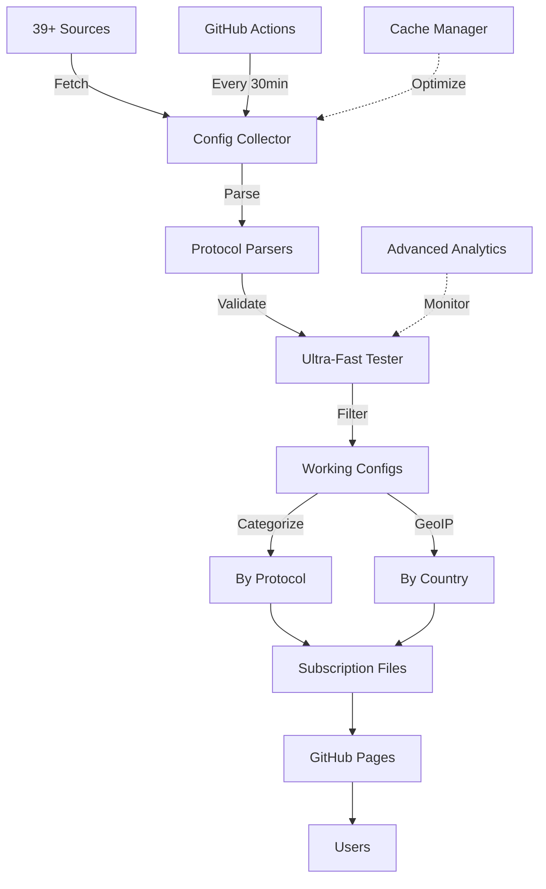

# 🚀 V2Ray Collector - جمع‌آوری هوشمند کانفیگ‌های V2Ray

<div align="center">


**سیستم پیشرفته جمع‌آوری، تست و دسته‌بندی خودکار کانفیگ‌های V2Ray از 39+ منبع معتبر**

[🌐 دموی زنده](https://ahmadakd.github.io/V2Ray_Collector/) • [📚 مستندات](https://github.com/AhmadAkd/V2Ray_Collector/tree/main/docs) • [🐛 گزارش باگ](https://github.com/AhmadAkd/V2Ray_Collector/issues) • [🌟 ستاره بدهید](https://github.com/AhmadAkd/V2Ray_Collector)

</div>

---

## 📑 فهرست مطالب

- [✨ ویژگی‌های کلیدی](#-ویژگیهای-کلیدی)
- [🎯 معماری سیستم](#-معماری-سیستم)
- [🚀 شروع سریع](#-شروع-سریع)
- [📊 داشبورد و آمار](#-داشبورد-و-آمار)
- [🔧 پیکربندی پیشرفته](#-پیکربندی-پیشرفته)
- [📡 پروتکل‌های پشتیبانی شده](#-پروتکلهای-پشتیبانی-شده)
- [🌍 دسته‌بندی جغرافیایی](#-دستهبندی-جغرافیایی)
- [🤝 مشارکت](#-مشارکت)
- [📄 مجوز](#-مجوز)

---

## ✨ ویژگی‌های کلیدی

### 🔥 **قابلیت‌های اصلی**

<table>
<tr>
<td width="50%">

#### 🤖 **جمع‌آوری هوشمند**
- ✅ **39+ منبع معتبر** از GitHub و منابع عمومی
- ✅ **پشتیبانی SingBox JSON** برای فرمت‌های مختلف
- ✅ **Base64 Decoding** با پشتیبانی کامل از تمام فرمت‌ها
- ✅ **حذف خودکار تکراری‌ها** با الگوریتم بهینه
- ✅ **Cache Manager** برای کاهش درخواست‌های شبکه

</td>
<td width="50%">

#### ⚡ **تست فوق سریع**
- ✅ **Ultra-Fast Connection Pool** با 50 تست همزمان
- ✅ **Advanced Protocol Testing** با handshake و response validation
- ✅ **Timeout Management** برای عملکرد بهینه
- ✅ **Retry Logic** با exponential backoff
- ✅ **میانگین 10,000+ کانفیگ** در هر بروزرسانی

</td>
</tr>
<tr>
<td width="50%">

#### 🎨 **رابط کاربری مدرن**
- ✅ **Dashboard تحلیلی** با Chart.js
- ✅ **Real-time Statistics** با بروزرسانی خودکار
- ✅ **طراحی Responsive** سازگار با موبایل
- ✅ **Dark/Light Theme** (در حال توسعه)
- ✅ **Copy با یک کلیک** برای تمام لینک‌ها

</td>
<td width="50%">

#### 🗂️ **دسته‌بندی هوشمند**
- ✅ **دسته‌بندی پروتکل** (VMess, VLESS, Trojan, SS, SSR, Hysteria)
- ✅ **دسته‌بندی کشور** با GeoIP Lookup
- ✅ **فیلتر بر اساس Latency**
- ✅ **Subscription Links** برای هر دسته
- ✅ **Auto-Generated Files** در هر 30 دقیقه

</td>
</tr>
</table>

---

## 🎯 معماری سیستم



### 🏗️ **ساختار پروژه**

```
V2Ray_Collector/
├── 🎯 Core Components
│   ├── config_collector.py      # موتور اصلی جمع‌آوری
│   ├── singbox_parser.py        # Parser فرمت SingBox
│   ├── geoip_lookup.py          # شناسایی کشور
│   └── cache_manager.py         # مدیریت کش
│
├── 🌐 Web Interface
│   ├── subscriptions/
│   │   ├── index.html           # صفحه اصلی
│   │   ├── dashboard.html       # داشبورد تحلیلی
│   │   ├── by_protocol/         # دسته‌بندی پروتکل
│   │   └── by_country/          # دسته‌بندی کشور
│   │
├── 🤖 Automation
│   ├── .github/workflows/
│   │   ├── v2ray-collector.yml # جمع‌آوری خودکار
│   │   └── deploy-pages.yml    # استقرار GitHub Pages
│   │
├── 📚 Documentation
│   ├── docs/                    # مستندات کامل
│   ├── README.md                # فارسی
│   └── README_EN.md             # انگلیسی
│
└── ⚙️ Configuration
    ├── config.py                # تنظیمات اصلی
    ├── requirements.txt         # وابستگی‌های Python
    └── config.env.example       # متغیرهای محیطی
```

---

## 🚀 شروع سریع

### 📦 **نصب**

#### روش 1: استفاده مستقیم از Subscription Links

ساده‌ترین روش! فقط لینک مورد نظر رو کپی کنید:

```bash
# تمام کانفیگ‌ها
https://ahmadakd.github.io/V2Ray_Collector/subscriptions/all_subscription.txt

# فقط VMess
https://ahmadakd.github.io/V2Ray_Collector/subscriptions/by_protocol/vmess.txt

# فقط آمریکا
https://ahmadakd.github.io/V2Ray_Collector/subscriptions/by_country/US.txt
```

#### روش 2: نصب Local

```bash
# 1. Clone کردن
git clone https://github.com/AhmadAkd/V2Ray_Collector.git
cd V2Ray_Collector

# 2. نصب Dependencies
pip install -r requirements.txt

# 3. اجرای جمع‌آوری
python config_collector.py

# 4. مشاهده نتایج
open subscriptions/index.html
```

#### روش 3: استفاده از Docker

```bash
# Build
docker build -t v2ray-collector .

# Run
docker run -d \
  --name v2ray-collector \
  -v $(pwd)/subscriptions:/app/subscriptions \
  v2ray-collector

# مشاهده logs
docker logs -f v2ray-collector
```

---

## 📊 داشبورد و آمار

### 🎨 **رابط کاربری**

<table>
<tr>
<td width="50%">

#### 🏠 **صفحه اصلی**
- آمار کلی (Working/Failed/Success Rate)
- لینک‌های Subscription بر اساس پروتکل
- لینک‌های Subscription بر اساس کشور
- کپی سریع با یک کلیک
- دکمه دانلود برای تمام فایل‌ها

</td>
<td width="50%">

#### 📈 **داشبورد تحلیلی**
- نمودار دایره‌ای توزیع پروتکل‌ها
- نمودار میله‌ای Top 10 کشورها
- نمودار خطی مقایسه Latency
- جداول تفصیلی آماری
- بروزرسانی Real-time

</td>
</tr>
</table>

### 📈 **آمار زنده**

<div align="center">

| 📊 Metric | 📈 Value | 📝 Description |
|-----------|----------|----------------|
| **🌐 منابع فعال** | `39` | منابع معتبر و تست شده |
| **🔧 پروتکل‌ها** | `17+` | پشتیبانی از پروتکل‌های مختلف |
| **🌍 کشورها** | `25+` | پوشش جهانی |
| **⚡ کانفیگ‌های سالم** | `7,000+` | تست شده و کارآمد |
| **🔄 بروزرسانی** | `30 دقیقه` | جمع‌آوری خودکار |
| **📊 Success Rate** | `70%+` | نرخ موفقیت تست |

</div>

---

## 🔧 پیکربندی پیشرفته

### ⚙️ **تنظیمات اصلی** (`config.py`)

```python
# تنظیمات جمع‌آوری
COLLECTION_CONFIG = {
    'max_concurrent_tests': 50,      # تعداد تست همزمان
    'test_timeout': 10,              # Timeout به ثانیه
    'min_latency_threshold': 5000,   # حداکثر تأخیر قابل قبول (ms)
    'enable_speed_test': True,       # فعال‌سازی تست سرعت
    'enable_ssl_check': True,        # بررسی گواهی SSL
}

# تنظیمات دسته‌بندی
CATEGORIZATION_CONFIG = {
    'max_configs_per_protocol': 2000,  # حداکثر کانفیگ به ازای هر پروتکل
    'max_configs_per_country': 1000,   # حداکثر کانفیگ به ازای هر کشور
    'min_configs_per_protocol': 10,    # حداقل برای ایجاد فایل
    'enable_deduplication': True,       # حذف تکراری‌ها
}

# تنظیمات Cache
CACHE_CONFIG = {
    'enable_cache': True,           # فعال‌سازی کش
    'cache_ttl': 1800,              # مدت اعتبار (ثانیه)
    'cache_dir': 'cache',           # مسیر ذخیره کش
}
```

### 🔐 **متغیرهای محیطی** (`.env`)

```bash
# Telegram Bot (اختیاری)
TELEGRAM_BOT_TOKEN=your_bot_token_here
TELEGRAM_CHAT_ID=your_chat_id_here

# GitHub (برای استقرار خودکار)
GITHUB_TOKEN=ghp_your_token_here
GITHUB_REPOSITORY=username/repository

# Advanced Settings
LOG_LEVEL=INFO
ENABLE_ANALYTICS=true
ENABLE_NOTIFICATIONS=true
```

---

## 📡 پروتکل‌های پشتیبانی شده

<table>
<tr>
<td width="33%">

### ⚡ **High Performance**
- ✅ VMess
- ✅ VLESS
- ✅ Trojan
- ✅ Hysteria / Hysteria2
- ✅ Hysteria3

</td>
<td width="33%">

### 🔒 **Classic Protocols**
- ✅ Shadowsocks (SS)
- ✅ ShadowsocksR (SSR)
- ✅ TUIC / TUIC v5
- ✅ WireGuard
- ✅ Naive

</td>
<td width="33%">

### 🚀 **Advanced**
- ✅ Reality
- ✅ Xray Reality
- ✅ SingBox
- ✅ Clash Meta
- ✅ و بیشتر...

</td>
</tr>
</table>

### 📊 **آمار پروتکل‌ها**

```
VLESS     ████████████████████████████ 68%  (5,119)
VMess     █████████████ 22%  (1,617)
Trojan    ███ 5%  (175)
SS        ███ 3%  (536)
SSR       █ 1%  (2)
Hysteria  █ 1%  (تعداد متغیر)
```

---

## 🌍 دسته‌بندی جغرافیایی

### 🗺️ **پوشش کشورها**

<table>
<tr>
<td>

#### 🌎 **آمریکای شمالی**
- 🇺🇸 آمریکا (2,800+ کانفیگ)
- 🇨🇦 کانادا (20+ کانفیگ)

#### 🌍 **اروپا**
- 🇩🇪 آلمان (100+ کانفیگ)
- 🇬🇧 انگلستان (30+ کانفیگ)
- 🇫🇷 فرانسه (110+ کانفیگ)
- 🇳🇱 هلند (75+ کانفیگ)
- و 10+ کشور دیگر

</td>
<td>

#### 🌏 **آسیا**
- 🇮🇷 ایران (1,180+ کانفیگ)
- 🇯🇵 ژاپن (30+ کانفیگ)
- 🇸🇬 سنگاپور (20+ کانفیگ)
- 🇭🇰 هنگ کنگ (85+ کانفیگ)
- 🇰🇷 کره جنوبی (8+ کانفیگ)

#### 🌍 **سایر مناطق**
- 🇦🇺 استرالیا
- 🇧🇷 برزیل
- و موارد دیگر...

</td>
</tr>
</table>

---

## 🤖 Automation با GitHub Actions

سیستم به صورت کاملاً خودکار هر **30 دقیقه** یکبار:

1. ✅ از 39+ منبع کانفیگ جمع‌آوری می‌کند
2. ✅ تمام کانفیگ‌ها را تست می‌کند
3. ✅ کانفیگ‌های سالم را دسته‌بندی می‌کند
4. ✅ فایل‌های Subscription را بروز می‌کند
5. ✅ داشبورد و آمار را refresh می‌کند
6. ✅ به GitHub Pages deploy می‌کند

### 📅 **زمان‌بندی**

```yaml
schedule:
  - cron: '*/30 * * * *'  # هر 30 دقیقه
```

---

## 🛠️ API و ادغام

### 📡 **REST API** (در حال توسعه)

```javascript
// دریافت آمار کلی
GET /api/v1/stats

// دریافت کانفیگ‌ها بر اساس پروتکل
GET /api/v1/configs/protocol/:protocol

// دریافت کانفیگ‌ها بر اساس کشور
GET /api/v1/configs/country/:country

// دریافت گزارش جزئیات
GET /api/v1/report
```

### 🔗 **Webhook Integration**

```bash
# ارسال اعلان به Telegram
curl -X POST https://api.telegram.org/bot{TOKEN}/sendMessage \
  -d chat_id={CHAT_ID} \
  -d text="🚀 V2Ray Collector: 7,449 کانفیگ سالم جمع‌آوری شد!"
```

---

## 📚 مستندات کامل

<table>
<tr>
<td width="50%">

### 📖 **راهنماها**
- [📘 نصب و راه‌اندازی](docs/INSTALLATION.md)
- [👤 راهنمای کاربر](docs/USER_GUIDE.md)
- [💻 راهنمای توسعه‌دهنده](docs/DEVELOPER.md)
- [🐛 عیب‌یابی](docs/TROUBLESHOOTING.md)

</td>
<td width="50%">

### 📝 **سند‌ها**
- [🔄 CHANGELOG](CHANGELOG.md)
- [🤝 مشارکت](CONTRIBUTING.md)
- [🔒 امنیت](SECURITY.md)
- [✨ بهبودها](IMPROVEMENTS.md)

</td>
</tr>
</table>

---

## 🤝 مشارکت

می‌خواهید در بهبود این پروژه مشارکت کنید؟ عالیه! 🎉

### 🌟 **روش‌های مشارکت**

1. **🐛 گزارش باگ**: [Issues](https://github.com/AhmadAkd/V2Ray_Collector/issues)
2. **💡 پیشنهاد ویژگی**: [Feature Requests](https://github.com/AhmadAkd/V2Ray_Collector/issues/new)
3. **🔧 Pull Request**: [Contributing Guide](CONTRIBUTING.md)
4. **⭐ ستاره بدهید**: اگر مفید بود!
5. **📢 به اشتراک بگذارید**: با دوستان خود

### 🏆 **مشارکت‌کنندگان**

<a href="https://github.com/AhmadAkd/V2Ray_Collector/graphs/contributors">
  
</a>

---

## 🎯 Roadmap

### ✅ **نسخه فعلی (v2.0)**
- ✅ 39 منبع معتبر
- ✅ 17+ پروتکل
- ✅ SingBox Parser
- ✅ Dashboard مدرن
- ✅ GeoIP Lookup
- ✅ Cache Manager

### 🚧 **نسخه بعدی (v2.1)**
- ⏳ Telegram Bot Integration (تکمیل 70%)
- ⏳ Advanced Monitoring (تکمیل 80%)
- ⏳ REST API (در حال توسعه)
- ⏳ Docker Support (تکمیل 60%)
- ⏳ Dark Mode (در حال طراحی)

### 🔮 **آینده (v3.0)**
- 🔜 Machine Learning برای انتخاب بهترین کانفیگ
- 🔜 پشتیبانی از WireGuard
- 🔜 Mobile App (Android/iOS)
- 🔜 پنل مدیریت کامل
- 🔜 Multi-Language Support

---

## 📊 آمار پروژه

<div align="center">


</div>

---

## 💖 حمایت از پروژه

اگر این پروژه برای شما مفید بود:

- ⭐ **ستاره بدهید** به این Repository
- 🐛 **باگ‌ها را گزارش کنید** در Issues
- 💡 **ایده‌های جدید** را با ما به اشتراک بگذارید
- 📢 **به اشتراک بگذارید** با دوستان خود
- ☕ **حمایت مالی** (در صورت تمایل)

---

## 📄 مجوز

این پروژه تحت مجوز [MIT License](LICENSE) منتشر شده است.

```
MIT License

Copyright (c) 2025 Ahmad Akd

مجوز استفاده، کپی، تغییر و توزیع رایگان داده می‌شود.
```

---

## 📞 تماس با ما

<div align="center">

[](https://github.com/AhmadAkd)
[](mailto:your.email@example.com)
[](https://t.me/your_channel)

</div>

---

<div align="center">

**ساخته شده با ❤️ توسط [Ahmad Akd](https://github.com/AhmadAkd)**

**اگر این پروژه برایتان مفید بود، ⭐ ستاره فراموش نشه!**

</div>

---

## 🎉 تشکر ویژه

از تمام منابع، مشارکت‌کنندگان و کاربرانی که این پروژه را بهتر می‌کنند، سپاسگزاریم! 🙏

<div align="center">

**[🏠 بازگشت به بالا](#-v2ray-collector---جمعآوری-هوشمند-کانفیگهای-v2ray)**

</div>
