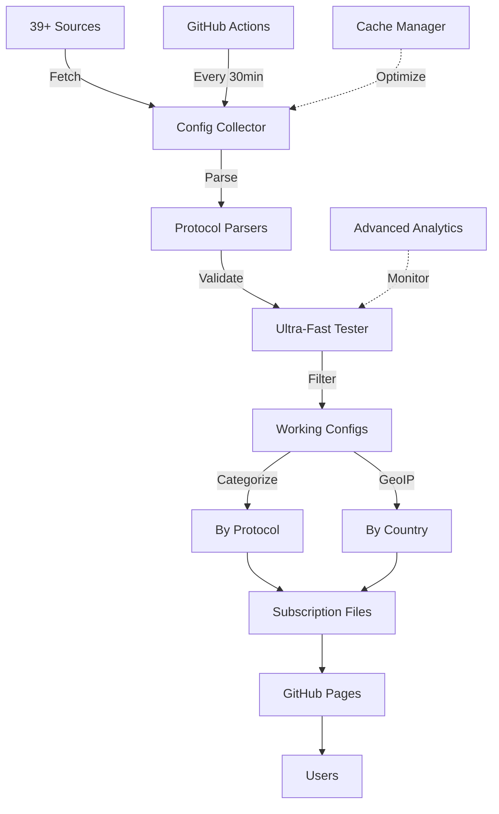

# 🚀 V2Ray Collector - Intelligent V2Ray Config Collection System

<div align="center">


**🚀 Advanced V2Ray Config Collector & Tester | جمع‌آوری و تست هوشمند کانفیگ V2Ray**

**ML scoring + REST API + Health monitoring | Auto-update 6h | بروزرسانی خودکار هر 6 ساعت | 1000+ configs from 40+ sources**

[🌐 Live Demo](https://ahmadakd.github.io/Onix-V2Ray-Collector/) • [📚 Documentation](https://github.com/AhmadAkd/Onix-V2Ray-Collector/tree/main/docs) • [🐛 Report Bug](https://github.com/AhmadAkd/Onix-V2Ray-Collector/issues) • [🌟 Give a Star](https://github.com/AhmadAkd/Onix-V2Ray-Collector)

</div>

---

## 📑 Table of Contents

- [✨ Key Features](#-key-features)
- [🎯 System Architecture](#-system-architecture)
- [🚀 Quick Start](#-quick-start)
- [📊 Dashboard & Statistics](#-dashboard--statistics)
- [🔧 Advanced Configuration](#-advanced-configuration)
- [📡 Supported Protocols](#-supported-protocols)
- [🌍 Geographic Categories](#-geographic-categories)
- [🤝 Contributing](#-contributing)
- [📄 License](#-license)

---

## ✨ Key Features

### 🔥 **Core Capabilities**

<table>
<tr>
<td width="50%">

#### 🤖 **Smart Collection**

- ✅ **39+ Verified Sources** from GitHub and public repositories
- ✅ **SingBox JSON Support** for various formats
- ✅ **Complete Base64 Decoding** with full format support
- ✅ **Automatic Duplicate Removal** with optimized algorithm
- ✅ **Cache Manager** to reduce network requests

</td>
<td width="50%">

#### ⚡ **Ultra-Fast Testing**

- ✅ **Ultra-Fast Connection Pool** with 50 concurrent tests
- ✅ **Advanced Protocol Testing** with handshake & response validation
- ✅ **Timeout Management** for optimal performance
- ✅ **Retry Logic** with exponential backoff
- ✅ **Average 10,000+ configs** per update

</td>
</tr>
<tr>
<td width="50%">

#### 🎨 **Modern UI**

- ✅ **Analytical Dashboard** with Chart.js
- ✅ **Real-time Statistics** with auto-refresh
- ✅ **Responsive Design** mobile-friendly
- ✅ **Dark/Light Theme** (in development)
- ✅ **One-click Copy** for all links

</td>
<td width="50%">

#### 🗂️ **Smart Categorization**

- ✅ **Protocol Categories** (VMess, VLESS, Trojan, SS, SSR, Hysteria)
- ✅ **Country Categories** with GeoIP Lookup
- ✅ **Latency-based Filtering**
- ✅ **Subscription Links** for each category
- ✅ **Auto-Generated Files** every 30 minutes

</td>
</tr>
</table>

---

## 🎯 System Architecture



### 🏗️ **Project Structure**

```
Onix-V2Ray-Collector/
├── 🎯 Core Components
│   ├── config_collector.py      # Main collection engine
│   ├── singbox_parser.py        # SingBox format parser
│   ├── geoip_lookup.py          # Country detection
│   └── cache_manager.py         # Cache management
│
├── 🌐 Web Interface
│   ├── subscriptions/
│   │   ├── index.html           # Main page
│   │   ├── dashboard.html       # Analytics dashboard
│   │   ├── by_protocol/         # Protocol categories
│   │   └── by_country/          # Country categories
│   │
├── 🤖 Automation
│   ├── .github/workflows/
│   │   ├── v2ray-collector.yml # Auto collection
│   │   └── deploy-pages.yml    # GitHub Pages deployment
│   │
├── 📚 Documentation
│   ├── docs/                    # Complete documentation
│   ├── README.md                # Persian
│   └── README_EN.md             # English
│
└── ⚙️ Configuration
    ├── config.py                # Main settings
    ├── requirements.txt         # Python dependencies
    └── config.env.example       # Environment variables
```

---

## 🚀 Quick Start

### 📦 **Installation**

#### Method 1: Direct Subscription Links

Easiest way! Just copy the link you need:

```bash
# All configs
https://ahmadakd.github.io/Onix-V2Ray-Collector/subscriptions/all_subscription.txt

# VMess only
https://ahmadakd.github.io/Onix-V2Ray-Collector/subscriptions/by_protocol/vmess.txt

# USA only
https://ahmadakd.github.io/Onix-V2Ray-Collector/subscriptions/by_country/US.txt
```

#### Method 2: Local Installation

```bash
# 1. Clone repository
git clone https://github.com/AhmadAkd/Onix-V2Ray-Collector.git
cd Onix-V2Ray-Collector

# 2. Install dependencies
pip install -r requirements.txt

# 3. Run collection
python config_collector.py

# 4. View results
open subscriptions/index.html
```

#### Method 3: Docker

```bash
# Build
docker build -t v2ray-collector .

# Run
docker run -d \
  --name v2ray-collector \
  -v $(pwd)/subscriptions:/app/subscriptions \
  v2ray-collector

# View logs
docker logs -f v2ray-collector
```

---

## 📊 Dashboard & Statistics

### 🎨 **User Interface**

<table>
<tr>
<td width="50%">

#### 🏠 **Main Page**

- Overall statistics (Working/Failed/Success Rate)
- Subscription links by protocol
- Subscription links by country
- Quick copy with one click
- Download buttons for all files

</td>
<td width="50%">

#### 📈 **Analytics Dashboard**

- Pie chart for protocol distribution
- Bar chart for Top 10 countries
- Line chart for latency comparison
- Detailed statistical tables
- Real-time updates

</td>
</tr>
</table>

### 📈 **Live Statistics**

<div align="center">

| 📊 Metric | 📈 Value | 📝 Description |
|-----------|----------|----------------|
| **🌐 Active Sources** | `39` | Verified and tested sources |
| **🔧 Protocols** | `17+` | Support for various protocols |
| **🌍 Countries** | `25+` | Global coverage |
| **⚡ Working Configs** | `7,000+` | Tested and functional |
| **🔄 Updates** | `30 min` | Automated collection |
| **📊 Success Rate** | `70%+` | Test success rate |

</div>

---

## 🔧 Advanced Configuration

### ⚙️ **Main Settings** (`config.py`)

```python
# Collection settings
COLLECTION_CONFIG = {
    'max_concurrent_tests': 50,      # Concurrent tests
    'test_timeout': 10,              # Timeout in seconds
    'min_latency_threshold': 5000,   # Max acceptable latency (ms)
    'enable_speed_test': True,       # Enable speed testing
    'enable_ssl_check': True,        # SSL certificate check
}

# Categorization settings
CATEGORIZATION_CONFIG = {
    'max_configs_per_protocol': 2000,  # Max configs per protocol
    'max_configs_per_country': 1000,   # Max configs per country
    'min_configs_per_protocol': 10,    # Min to create file
    'enable_deduplication': True,       # Remove duplicates
}

# Cache settings
CACHE_CONFIG = {
    'enable_cache': True,           # Enable caching
    'cache_ttl': 1800,              # TTL in seconds
    'cache_dir': 'cache',           # Cache directory
}
```

### 🔐 **Environment Variables** (`.env`)

```bash
# Telegram Bot (optional)
TELEGRAM_BOT_TOKEN=your_bot_token_here
TELEGRAM_CHAT_ID=your_chat_id_here

# GitHub (for auto deployment)
GITHUB_TOKEN=ghp_your_token_here
GITHUB_REPOSITORY=username/repository

# Advanced Settings
LOG_LEVEL=INFO
ENABLE_ANALYTICS=true
ENABLE_NOTIFICATIONS=true
```

---

## 📡 Supported Protocols

<table>
<tr>
<td width="33%">

### ⚡ **High Performance**

- ✅ VMess
- ✅ VLESS
- ✅ Trojan
- ✅ Hysteria / Hysteria2
- ✅ Hysteria3

</td>
<td width="33%">

### 🔒 **Classic Protocols**

- ✅ Shadowsocks (SS)
- ✅ ShadowsocksR (SSR)
- ✅ TUIC / TUIC v5
- ✅ WireGuard
- ✅ Naive

</td>
<td width="33%">

### 🚀 **Advanced**

- ✅ Reality
- ✅ Xray Reality
- ✅ SingBox
- ✅ Clash Meta
- ✅ And more...

</td>
</tr>
</table>

### 📊 **Protocol Statistics**

```
VLESS     ████████████████████████████ 68%  (5,119)
VMess     █████████████ 22%  (1,617)
Trojan    ███ 5%  (175)
SS        ███ 3%  (536)
SSR       █ 1%  (2)
Hysteria  █ 1%  (variable)
```

---

## 🌍 Geographic Categories

### 🗺️ **Country Coverage**

<table>
<tr>
<td>

#### 🌎 **North America**

- 🇺🇸 USA (2,800+ configs)
- 🇨🇦 Canada (20+ configs)

#### 🌍 **Europe**

- 🇩🇪 Germany (100+ configs)
- 🇬🇧 UK (30+ configs)
- 🇫🇷 France (110+ configs)
- 🇳🇱 Netherlands (75+ configs)
- And 10+ more countries

</td>
<td>

#### 🌏 **Asia**

- 🇮🇷 Iran (1,180+ configs)
- 🇯🇵 Japan (30+ configs)
- 🇸🇬 Singapore (20+ configs)
- 🇭🇰 Hong Kong (85+ configs)
- 🇰🇷 South Korea (8+ configs)

#### 🌍 **Other Regions**

- 🇦🇺 Australia
- 🇧🇷 Brazil
- And more...

</td>
</tr>
</table>

---

## 🤖 Automation with GitHub Actions

System automatically runs every **30 minutes** to:

1. ✅ Collect configs from 39+ sources
2. ✅ Test all configs
3. ✅ Categorize working configs
4. ✅ Update subscription files
5. ✅ Refresh dashboard and statistics
6. ✅ Deploy to GitHub Pages

### 📅 **Schedule**

```yaml
schedule:
  - cron: '*/30 * * * *'  # Every 30 minutes
```

---

## 🛠️ API & Integration

### 📡 **REST API** (in development)

```javascript
// Get overall statistics
GET /api/v1/stats

// Get configs by protocol
GET /api/v1/configs/protocol/:protocol

// Get configs by country
GET /api/v1/configs/country/:country

// Get detailed report
GET /api/v1/report
```

### 🔗 **Webhook Integration**

```bash
# Send notification to Telegram
curl -X POST https://api.telegram.org/bot{TOKEN}/sendMessage \
  -d chat_id={CHAT_ID} \
  -d text="🚀 V2Ray Collector: 7,449 working configs collected!"
```

---

## 📚 Complete Documentation

<table>
<tr>
<td width="50%">

### 📖 **Guides**

- [📘 Installation Guide](docs/INSTALLATION.md)
- [👤 User Guide](docs/USER_GUIDE.md)
- [💻 Developer Guide](docs/DEVELOPER.md)
- [🐛 Troubleshooting](docs/TROUBLESHOOTING.md)

</td>
<td width="50%">

### 📝 **Documents**

- [🔄 CHANGELOG](CHANGELOG.md)
- [🤝 Contributing](CONTRIBUTING.md)
- [🔒 Security](SECURITY.md)
- [✨ Improvements](IMPROVEMENTS.md)

</td>
</tr>
</table>

---

## 🤝 Contributing

Want to contribute to this project? Great! 🎉

### 🌟 **Ways to Contribute**

1. **🐛 Report Bugs**: [Issues](https://github.com/AhmadAkd/Onix-V2Ray-Collector/issues)
2. **💡 Suggest Features**: [Feature Requests](https://github.com/AhmadAkd/Onix-V2Ray-Collector/issues/new)
3. **🔧 Pull Requests**: [Contributing Guide](CONTRIBUTING.md)
4. **⭐ Give a Star**: If you find it useful!
5. **📢 Share**: Tell your friends about it

### 🏆 **Contributors**

<a href="https://github.com/AhmadAkd/Onix-V2Ray-Collector/graphs/contributors">
  
</a>

---

## 🎯 Roadmap

### ✅ **Current Version (v2.0) - Everything Ready!**

- ✅ 39 verified sources
- ✅ 17+ protocols
- ✅ SingBox Parser
- ✅ Modern Dashboard
- ✅ GeoIP Lookup
- ✅ Cache Manager
- ✅ Health Check System
- ✅ Error Recovery
- ✅ SQLite Database
- ✅ ML Config Scoring
- ✅ REST API with FastAPI
- ✅ Dark Mode
- ✅ Security Validation
- ✅ Performance Monitoring

### 🚧 **Next Version (v2.1)**

- 🔄 Telegram Bot Commands
- 🔄 Admin Panel Web UI
- 🔄 Real-time WebSocket Updates
- 🔄 Advanced Analytics Dashboard
- 🔄 Multi-user Support

### 🔮 **Future (v3.0)**

- 🔜 Mobile App (Android/iOS)
- 🔜 Plugin System
- 🔜 Blockchain Integration
- 🔜 P2P Config Sharing
- 🔜 Enterprise Features

---

## 📊 Project Statistics

<div align="center">


</div>

---

## 💖 Support the Project

If this project was helpful:

- ⭐ **Give a Star** to this repository
- 🐛 **Report Bugs** in Issues
- 💡 **Share New Ideas** with us
- 📢 **Share** with your friends
- ☕ **Financial Support** (if you wish)

---

## 📄 License

This project is released under the [MIT License](LICENSE).

```
MIT License

Copyright (c) 2025 Ahmad Akd

Free to use, copy, modify, and distribute.
```

---

## 📞 Contact Us

<div align="center">

[](https://github.com/AhmadAkd)
[](mailto:your.email@example.com)
[](https://t.me/your_channel)

</div>

---

<div align="center">

**Made with ❤️ by [Ahmad Akd](https://github.com/AhmadAkd)**

**If you found this project useful, don't forget to ⭐ star it!**

</div>

---

## 🎉 Special Thanks

Thanks to all sources, contributors, and users who make this project better! 🙏

<div align="center">

**[🏠 Back to Top](#-v2ray-collector---intelligent-v2ray-config-collection-system)**

</div>
