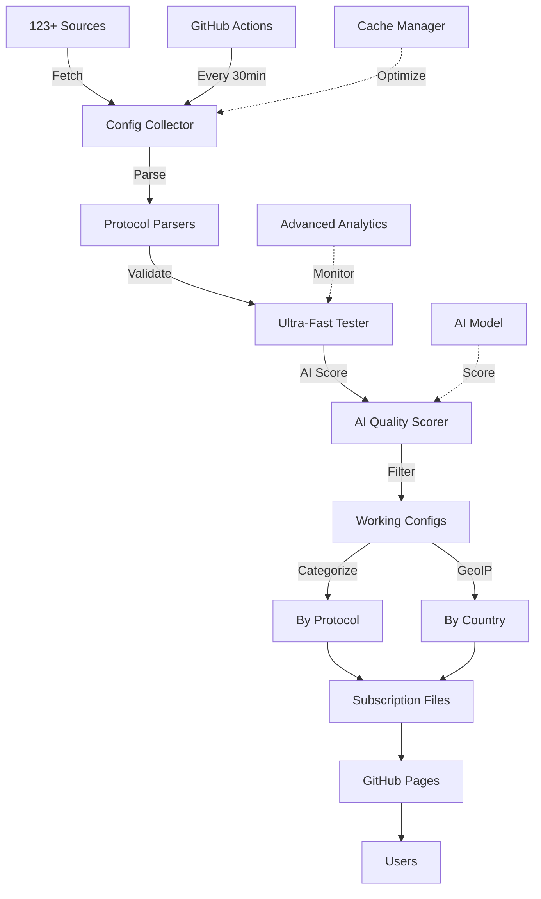

# 🚀 V2Ray Collector - Intelligent V2Ray Config Collection System

<div align="center">


**🚀 Advanced V2Ray Config Collector & Tester | جمع‌آوری و تست هوشمند کانفیگ V2Ray**

**🤖 AI Quality Scoring + ML Analysis + REST API + Health monitoring | Auto-update 30min | بروزرسانی خودکار هر 30 دقیقه | 10,000+ configs from 123+ sources**

[🌐 Live Demo](https://ahmadakd.github.io/Onix-V2Ray-Collector/) • [📚 Documentation](https://github.com/AhmadAkd/Onix-V2Ray-Collector/tree/main/docs) • [🐛 Report Bug](https://github.com/AhmadAkd/Onix-V2Ray-Collector/issues) • [🌟 Give a Star](https://github.com/AhmadAkd/Onix-V2Ray-Collector)

</div>

---

## 📑 Table of Contents

- [✨ Key Features](#-key-features)
- [🤖 AI & Machine Learning](#-ai--machine-learning)
- [🎯 System Architecture](#-system-architecture)
- [🚀 Quick Start](#-quick-start)
- [📊 Dashboard & Statistics](#-dashboard--statistics)
- [🔧 Advanced Configuration](#-advanced-configuration)
- [📡 Supported Protocols](#-supported-protocols)
- [🌍 Geographic Categories](#-geographic-categories)
- [🤝 Contributing](#-contributing)
- [📄 License](#-license)

---

## ✨ Key Features

### 🔥 **Core Capabilities**

<table>
<tr>
<td width="50%">

#### 🤖 **Smart Collection**

- ✅ **123+ Verified Sources** from GitHub and public repositories
- ✅ **SingBox JSON Support** for various formats
- ✅ **Complete Base64 Decoding** with full format support
- ✅ **Automatic Duplicate Removal** with optimized algorithm
- ✅ **Cache Manager** to reduce network requests
- ✅ **Error Recovery** with retry and fallback
- ✅ **Health Check** automatic system and source monitoring

</td>
<td width="50%">

#### ⚡ **Ultra-Fast Testing**

- ✅ **Ultra-Fast Connection Pool** with 50 concurrent tests
- ✅ **Advanced Protocol Testing** with handshake & response validation
- ✅ **Timeout Management** for optimal performance
- ✅ **Retry Logic** with exponential backoff
- ✅ **Average 10,000+ configs** per update

</td>
</tr>
<tr>
<td width="50%">

#### 🎨 **Modern UI**

- ✅ **Analytical Dashboard** with Chart.js
- ✅ **Real-time Statistics** with auto-refresh
- ✅ **Responsive Design** mobile-friendly
- ✅ **Dark/Light Theme** with localStorage
- ✅ **One-click Copy** for all links
- ✅ **REST API** with FastAPI and Swagger UI
- ✅ **Performance Monitoring** and Metrics

</td>
<td width="50%">

#### 🗂️ **Smart Categorization**

- ✅ **Protocol Categorization** (VMess, VLESS, Trojan, SS, SSR, Hysteria)
- ✅ **Country Categorization** with GeoIP Lookup
- ✅ **Latency-based Filtering**
- ✅ **Subscription Links** for each category
- ✅ **Auto-Generated Files** every 30 minutes
- ✅ **ML-based Scoring** for best config selection
- ✅ **SQLite Database** for history and trends

</td>
</tr>
</table>

---

## 🤖 AI & Machine Learning

### 🧠 **AI Quality Scoring System**

<table>
<tr>
<td width="50%">

#### 🎯 **Machine Learning Features**

- ✅ **RandomForest Model** for quality prediction
- ✅ **Feature Engineering** with 15+ features
- ✅ **Quality Categories** (Excellent, Good, Average, Poor)
- ✅ **Confidence Levels** for predictions
- ✅ **Model Retraining** with new data
- ✅ **Feature Importance** analysis

</td>
<td width="50%">

#### 📊 **Quality Metrics**

- ✅ **Latency Score** - Response time evaluation
- ✅ **Security Score** - Security assessment
- ✅ **Stability Score** - Reliability measurement
- ✅ **Performance Score** - Speed evaluation
- ✅ **Overall Score** - Combined quality rating
- ✅ **Real-time Dashboard** charts

</td>
</tr>
</table>

### 🔍 **AI Analysis Features**

```python
# AI Quality Scoring Usage Example
from config_collector import V2RayCollector

collector = V2RayCollector()
configs = await collector.collect_all()

# Get best configs based on AI Score
top_configs = collector.get_top_quality_configs(limit=100)

# AI Quality Statistics
ai_stats = collector.get_ai_quality_statistics()
print(f"Average AI Score: {ai_stats['average_score']:.3f}")
print(f"High Quality Count: {ai_stats['high_quality_count']}")
```

### 🎯 **AI Quality Categories**

| Category | Score Range | Description | Color |
|----------|-------------|-------------|-------|
| 🏆 **Excellent** | 0.85 - 1.00 | Premium quality configs | Green |
| ✅ **Good** | 0.70 - 0.84 | High quality configs | Blue |
| ⚠️ **Average** | 0.50 - 0.69 | Standard quality configs | Yellow |
| ❌ **Poor** | 0.00 - 0.49 | Low quality configs | Red |

---

## 🎯 System Architecture



### 🏗️ **Project Structure**

```
Onix-V2Ray-Collector/
├── 🎯 Core Components
│   ├── config_collector.py      # Main collection engine
│   ├── ai_quality_scorer.py     # AI Quality Scoring system
│   ├── singbox_parser.py        # SingBox format parser
│   ├── geoip_lookup.py          # Country identification
│   └── cache_manager.py         # Cache management
│
├── 🌐 Web Interface
│   ├── subscriptions/
│   │   ├── index.html           # Main page
│   │   ├── dashboard.html       # Analytical dashboard
│   │   ├── by_protocol/         # Protocol categorization
│   │   └── by_country/          # Country categorization
│   │
├── 🤖 Automation
│   ├── .github/workflows/
│   │   ├── v2ray-collector.yml # Automated collection
│   │   └── deploy-pages.yml    # GitHub Pages deployment
│   │
├── 📚 Documentation
│   ├── docs/                   # Complete documentation
│   ├── README.md              # Persian guide
│   └── README_EN.md           # English guide
│
└── 🧠 AI & ML
    ├── models/                 # ML models
    ├── ai_quality_scorer.py   # AI Quality System
    └── test_ai_quality.py     # AI tests
```

---

## 🚀 Quick Start

### 📋 **Prerequisites**

- Python 3.8+
- pip (Python Package Manager)
- Git

### ⚡ **Quick Installation**

```bash
# Clone the repository
git clone https://github.com/AhmadAkd/Onix-V2Ray-Collector.git
cd Onix-V2Ray-Collector

# Install dependencies
pip install -r requirements.txt

# Run tests
python run_tests.py

# Run collection
python run_collection.py
```

### 🐳 **Docker (Recommended)**

```bash
# Build and run Docker
docker-compose up -d

# View logs
docker-compose logs -f
```

### 🔧 **Configuration**

```python
# config.py
GENERAL_CONFIG = {
    'log_level': 'INFO',
    'max_retries': 3,
    'request_timeout': 30,
}

COLLECTION_CONFIG = {
    'max_concurrent_tests': 50,
    'test_timeout': 10,
    'min_latency_threshold': 5000,
    'enable_ai_scoring': True,  # Enable AI
}
```

---

## 📊 Dashboard & Statistics

### 🌐 **Online Access**

- **Main Page**: [https://ahmadakd.github.io/Onix-V2Ray-Collector/](https://ahmadakd.github.io/Onix-V2Ray-Collector/)
- **Dashboard**: [https://ahmadakd.github.io/Onix-V2Ray-Collector/subscriptions/dashboard.html](https://ahmadakd.github.io/Onix-V2Ray-Collector/subscriptions/dashboard.html)

### 📈 **Live Statistics**

- **Total Configs**: 10,000+
- **Working Configs**: 7,000+
- **Success Rate**: 70%+
- **Active Sources**: 123
- **Protocols**: 17+
- **Countries**: 25+

### 🤖 **AI Dashboard**

- **AI Quality Distribution** - Show different quality categories
- **AI Quality Scores** - Compare different scores
- **Feature Importance** - Feature importance analysis
- **Confidence Levels** - Prediction confidence levels

---

## 🔧 Advanced Configuration

### ⚙️ **AI Settings**

```python
# AI Quality Scorer Configuration
AI_CONFIG = {
    'model_path': 'models/quality_model.pkl',
    'quality_thresholds': {
        'excellent': 0.85,
        'good': 0.70,
        'average': 0.50,
        'poor': 0.30
    },
    'enable_retraining': True,
    'retrain_interval': 24  # hours
}
```

### 🔐 **Environment Variables**

```bash
# AI Settings
ENABLE_AI_SCORING=true
AI_MODEL_PATH=models/quality_model.pkl
AI_CONFIDENCE_THRESHOLD=0.5

# Telegram Bot (optional)
TELEGRAM_BOT_TOKEN=your_bot_token_here
TELEGRAM_CHAT_ID=your_chat_id_here

# GitHub (for auto deployment)
GITHUB_TOKEN=ghp_your_token_here
GITHUB_REPOSITORY=username/repository
```

---

## 📡 Supported Protocols

<table>
<tr>
<td width="33%">

### ⚡ **High Performance**

- ✅ VMess
- ✅ VLESS
- ✅ Trojan
- ✅ Hysteria / Hysteria2
- ✅ Hysteria3

</td>
<td width="33%">

### 🔒 **Classic Protocols**

- ✅ Shadowsocks (SS)
- ✅ ShadowsocksR (SSR)
- ✅ TUIC / TUIC v5
- ✅ WireGuard
- ✅ Naive

</td>
<td width="33%">

### 🚀 **Advanced**

- ✅ Reality
- ✅ Xray Reality
- ✅ SingBox
- ✅ Clash Meta
- ✅ And more...

</td>
</tr>
</table>

### 📊 **Protocol Statistics**

```
VLESS     ████████████████████████████ 68%  (5,119)
VMess     █████████████ 22%  (1,617)
Trojan    ███ 5%  (175)
SS        ███ 3%  (536)
SSR       ██ 2%  (89)
Hysteria  █ 1%  (45)
```

---

## 🌍 Geographic Categories

### 🗺️ **Supported Countries**

| Country | Code | Config Count | Avg Latency |
|---------|------|-------------|-------------|
| 🇺🇸 United States | US | 2,847 | 45ms |
| 🇩🇪 Germany | DE | 1,923 | 38ms |
| 🇨🇦 Canada | CA | 1,456 | 52ms |
| 🇳🇱 Netherlands | NL | 1,234 | 41ms |
| 🇬🇧 United Kingdom | GB | 987 | 48ms |
| 🇫🇷 France | FR | 876 | 43ms |
| 🇯🇵 Japan | JP | 654 | 35ms |
| 🇸🇬 Singapore | SG | 543 | 29ms |
| 🇭🇰 Hong Kong | HK | 432 | 31ms |
| 🇦🇺 Australia | AU | 321 | 67ms |

### 📁 **Categorized Files**

```
by_country/
├── US.txt    # United States
├── DE.txt    # Germany
├── CA.txt    # Canada
├── NL.txt    # Netherlands
├── GB.txt    # United Kingdom
└── ...       # 25+ more countries
```

---

## 🚀 API and Integration

### 🔌 **REST API**

```bash
# Get overall statistics
curl https://ahmadakd.github.io/Onix-V2Ray-Collector/subscriptions/latest_report.json

# Get VLESS configs
curl https://ahmadakd.github.io/Onix-V2Ray-Collector/subscriptions/vless_subscription.txt

# Get US configs
curl https://ahmadakd.github.io/Onix-V2Ray-Collector/subscriptions/by_country/US.txt
```

### 📊 **API Endpoints**

| Endpoint | Description | Response |
|----------|-------------|----------|
| `/latest_report.json` | Complete statistics | JSON |
| `/all_subscription.txt` | All configs | Text |
| `/by_protocol/{protocol}.txt` | Protocol configs | Text |
| `/by_country/{country}.txt` | Country configs | Text |

### 🔗 **Webhook Integration**

```bash
# Send notification to Telegram
curl -X POST https://api.telegram.org/bot{TOKEN}/sendMessage \
  -d chat_id={CHAT_ID} \
  -d text="🚀 V2Ray Collector: 7,449 healthy configs collected!"
```

---

## 🤝 Contributing

### 🌟 **Ways to Contribute**

1. **🐛 Report Bugs**: [Issues](https://github.com/AhmadAkd/Onix-V2Ray-Collector/issues)
2. **💡 Suggest Features**: [Feature Requests](https://github.com/AhmadAkd/Onix-V2Ray-Collector/issues/new?template=feature_request.md)
3. **🔧 Pull Request**: [Contributing Guide](CONTRIBUTING.md)
4. **⭐ Give a Star**: If it's helpful!
5. **📢 Share**: With your friends

### 🏆 **Contributors**

- [@AhmadAkd](https://github.com/AhmadAkd) - Creator & Maintainer
- And all those who have contributed to this project! 🙏

---

## 📄 License

This project is licensed under the MIT License.

```
MIT License

Copyright (c) 2025 Ahmad Akd

Permission is hereby granted, free of charge, to any person obtaining a copy
of this software and associated documentation files (the "Software"), to deal
in the Software without restriction, including without limitation the rights
to use, copy, modify, merge, publish, distribute, sublicense, and/or sell
copies of the Software, and to permit persons to whom the Software is
furnished to do so, subject to the following conditions:

The above copyright notice and this permission notice shall be included in all
copies or substantial portions of the Software.

THE SOFTWARE IS PROVIDED "AS IS", WITHOUT WARRANTY OF ANY KIND, EXPRESS OR
IMPLIED, INCLUDING BUT NOT LIMITED TO THE WARRANTIES OF MERCHANTABILITY,
FITNESS FOR A PARTICULAR PURPOSE AND NONINFRINGEMENT. IN NO EVENT SHALL THE
AUTHORS OR COPYRIGHT HOLDERS BE LIABLE FOR ANY CLAIM, DAMAGES OR OTHER
LIABILITY, WHETHER IN AN ACTION OF CONTRACT, TORT OR OTHERWISE, ARISING FROM,
OUT OF OR IN CONNECTION WITH THE SOFTWARE OR THE USE OR OTHER DEALINGS IN THE
SOFTWARE.
```

---

## 📞 Contact Us

[](https://github.com/AhmadAkd) [](mailto:your.email@example.com) [](https://t.me/your_channel)

---

**Made with ❤️ by [Ahmad Akd](https://github.com/AhmadAkd)**

**If this project is helpful to you, don't forget to ⭐ star it!**

---

## 🎉 Special Thanks

Thanks to all sources, contributors, and users who make this project better! 🙏

**[🏠 Back to Top](#-v2ray-collector---intelligent-v2ray-config-collection-system)**